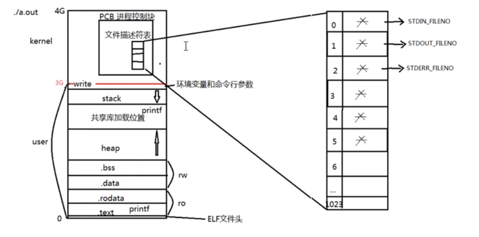
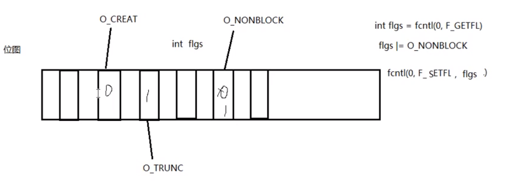
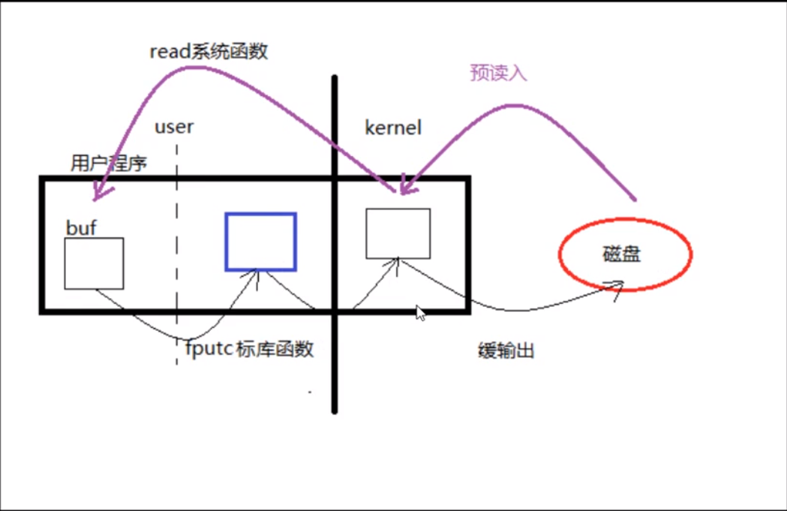
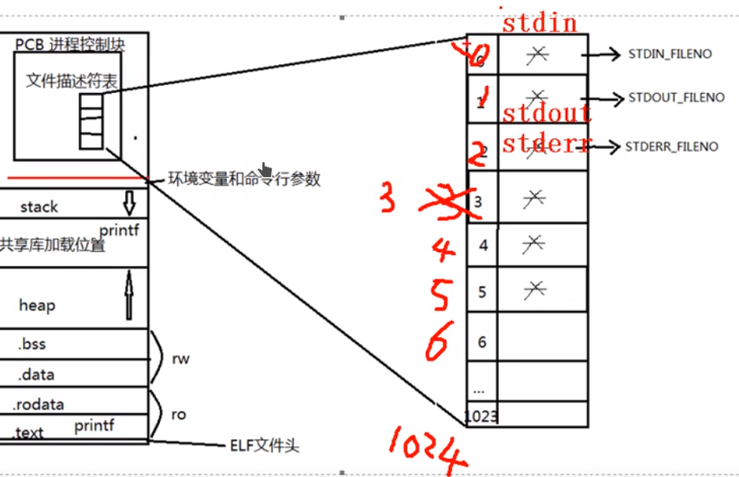
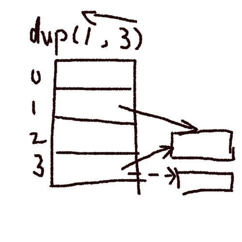
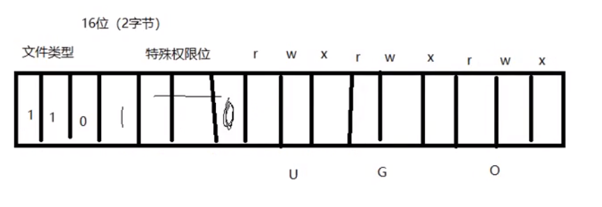

##### 用户程序结构

- 

## 文件I/O模型
#### 系统函数
##### open
- ~~~c
	#include <unistd.h>
	int open(const char *pathname, int flags);
	~~~
- 参数
	- pathname 路径
	- flags 文件打开方式
		- `#include <fcntl.h>`
		- `O_RDONLY|OWRONIY|O_RDWR|O_CREAT|O_APPEND|O_TRUNC(截断)|O_EXCL|O_NONBLOCK..`
- 返回值
	- 成功： 打开文件所得到的文件描述符（整数）
	- 失败 -1 **设置errno**
- ~~~c
	int open(const char *pathname, int flags, mode_t mode);//权限
	~~~

- 参数
	- pathname 路径
	- flags 文件打开方式
		- `O_RDONLY|OWRONIY|O_RDWR|O_CREAT|O_APPEND|O_TRUNC(截断)|O_EXCL|O_NONBLOCK..`
	- mode
		- 这个参数使用的前提：**参数指定了`O_CREAT` **
		- `0644`
		-  **创建文件最终的权限 = mode&umask**
- 返回值
	- 成功： 打开文件所得到的文件描述符（整数）
	- 失败 -1 **设置errno**
##### close
~~~c
int close(int fd)//open的返回值
~~~
##### error相关
~~~c
printf("%d",errno);
char * strerror(int errnum);
printf("%s",strerror(errno));//man 3
~~~

##### fcntl
~~~c
itn flags = fcntl(fd,F_GETFL);
~~~
- 获取文件状态
- 设置文件状态
##### lseek
~~~c
off_t lseek(int fd,offf_t offset,int whence);
~~~
###### 参数
- fd 文件描述符
- offset ·偏移量
- whence 起始偏移量
	- SEEK_SET
	- SEEK_CUR
	- SEEK_END
###### 返回值
- 成功 较起始位置的偏移量
- 失败 -1 error
###### 应用场景
- 文件的读写使用同一偏移位置
- 使用lseek获取文件大小
	~~~c
	int main(int argc, char* argv[])
	{
	int fd = open(argv[1], O_RDWR);
	int length = lseek(fd, 0, SEEK_END);
	printf("%d", length);
	return 0;
	}

	~~~
- 使用seek拓展文件大小：要想使文件大小真正拓展，必须引起IO操作
	- 可以使用truncate拓展函数
		~~~c
		int ret = truncate("test.txt",250);
		~~~
#### 位图

#### 缓冲
- 
### 文件描述符
- 
- pcb进程控制块：**一个结构体**
- 成员：文件描述符表
- 文件描述符：0、1、2、3、4、5。。。1023(重新编译内核可以修改)
	- 0 -STDIN_FILENO
	- 1 -STDOUT_FILENO
	- 2 -STDERR_FILENO

		### 阻塞、非阻塞
- **是设备文件、网络文件的属性**
- 产生阻塞的场景
	- 读设备文件
	- 读网络文件
	- 读常规文件没有阻塞概念
- /dev/tty
	~~~c

	#include <asm-generic/errno-base.h>
	#include <errno.h>
	#include <fcntl.h>
	#include <stdio.h>
	#include <stdlib.h>
	#include <string.h>
	#include <unistd.h>

	int main(void)
	{
	char buf[10];
	int fd, n;

	fd = open("/dev/tty", O_RDONLY | O_NONBLOCK);
	if (fd < 0) {
	perror("read error");
	exit(1);
	}
	tryagain:
	n = read(fd, buf, 10);
	if (n < 0) {
	if (errno != EAGAIN) {

	perror("read error");
	exit(1);
	} else {
	write(STDOUT_FILENO, "try again\n", strlen("try again\n"));
	sleep(2);
	goto tryagain;
	}
	}
	write(STDOUT_FILENO, buf, n);
	close(fd);
	return 0;
	}
	~~~
- open("/dev/tty", O_RDONLY | O_NONBLOCK); --设置非阻塞状态
#### 传入传出参数
##### 传入参数
- 指针作为函数参数
- 通常有`const`关键字修饰
- 函数调用前，指针指向的空间可以毫无意义，调用后指针指向的空间有意义，且**作为函数的返回值传出**
- 在函数内部写操作
##### 传出参数
- 指针作为函数参数
- 在函数调用前，指针指向的空间可以无意义，但必须有效
- 函数调用结束后充当函数返回值
- 在函数内写操作
##### 传出传出参数
- 指针作为函数参数
- 在函数调用前，指针指向的空间必须有意义
- 在函数内先读后写操作
- 函数调用结束后充当函数返回值
##### stat
~~~c
int stat(const (path,struct stat*buf));
~~~
- 参数
	- path 文件路径
	- buf 存放文件属性
- 返回值
- 获得文件大小 buf.st_size
- 获取文件类型 buf.set_mode
- 获取文件权限 buf.set_mode
- 符号穿透 stat 会 lsat 不会
#### stdio函数库
~~~c
#include <stdio.h>
size_t fread(void *ptr, size_t size, size_t nmemb, FILE *stream);
size_t fwrite(const void *ptr, size_t size, size_t nmemb,
FILE *stream);
~~~
### 文件存储
#### inode
**本质是结构体，存储文件的属性信息，如 权限 类型 大小 时间 用户 盘块位置 也称做文件属性管理结构，大多数的inode都存储在磁盘上**
~~~c

~~~

#### dup & dup2
~~~c
int dup(int oldfd);//oldfd 已有文件描述符
//返回新文件描述符

~~~
- 

	~~~c
	#include <fcntl.h>
	#include <pthread.h>
	#include <stdio.h>
	#include <stdlib.h>
	#include <string.h>
	#include <unistd.h>

	int main(int argc, char* argv[])
	{
	int fd1 = open(argv[1], O_RDWR);
	int fd2 = open(argv[2], O_RDWR);

	int fdret = dup2(fd1, fd2);
	printf("fdret = %d\n", fdret);

	int ret = write(fd2, "1234567", 7);
	printf("ret = %d\n", ret);

	dup2(fd1, STDOUT_FILENO);
	printf("test");
	return 0;
	}
	~~~

- 
