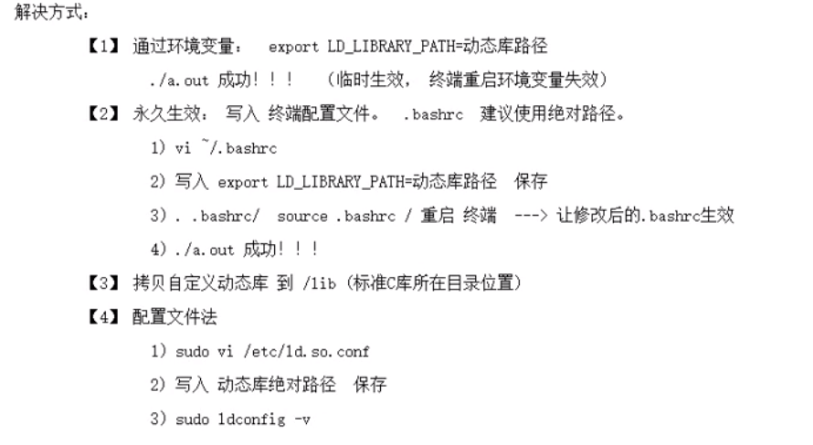

## 共享库
- 共享库的目的就是为了解决所存在静态库所存在的问题
- 如果将程序链接到共享库，那么链接器就不会把库中的目标模块复制到可执行文件，而是在可执行文件中写入一条记录，以表明可执行文件在运行时需要使用该共享库
- 一旦在运行时将可执行文件载入内存，**动态链接器**将确保可执行文件爱呢所需要的动态库找到，并载入内存随后实施运行是链接，解析可执行文件中的函数调用将其与共享库相应的函数定义关联起来
- 经过编译处理的函数仅在共享库保存一份，且可供所有运行中的程序使用
### 共享库的制作
1. 将.c生成.o文件（**生成与位置无管的代码**）
~~~bash
gcc -c add.c -o add.o -fPIC
~~~
2. 使用 `gcc -shared`制作动态库
~~~bash
gcc -shared lib库名.so add.o sub.o div.o

gcc -share -fpic -o libxxx.so yyy.c
~~~
3. 编译可执行程序时，指定所使用的动态库名。-l:指定库名 -L：指定库路径
~~~bash
gcc test.c -lclc -L ./lib -I ./inc -o test
~~~
4. 运行可执行文件是会出错
原因：
- 链接器： 工作于链接阶段，工作时需要提供-l -L
- 动态链接器：与链接器没有关系，工作在程序运行阶段，工作时需要提供动态库所在的目录，可以通过设置环境变量`export LD_LIBRARY_PATH=动态库路径`
- 
#### 共享库原理初识
- 地址回填
	- 以main函数为基址的重定位
	- 
- 数据合并
	- 在链接阶段 code 和indaba  data和bss合并对齐
