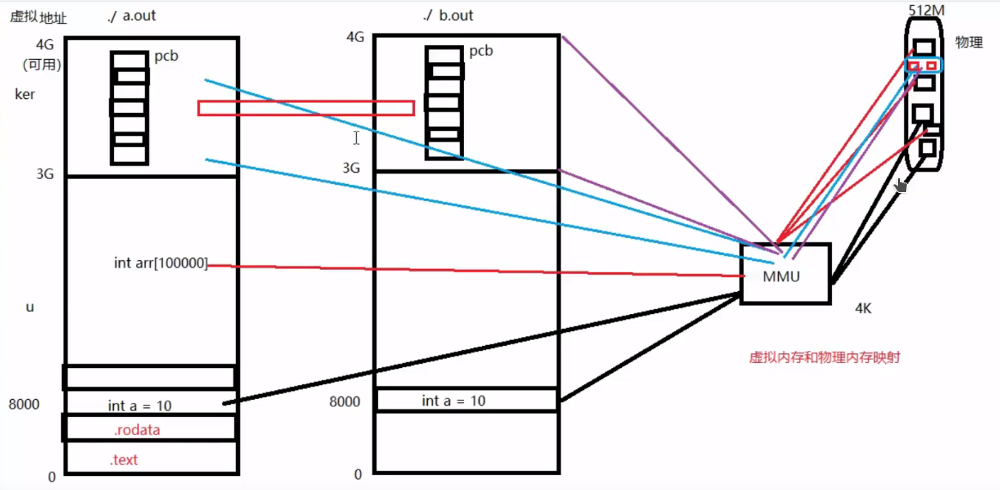
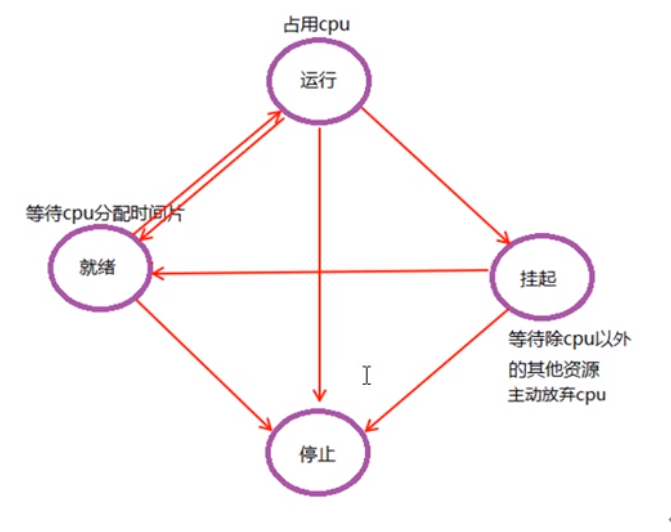
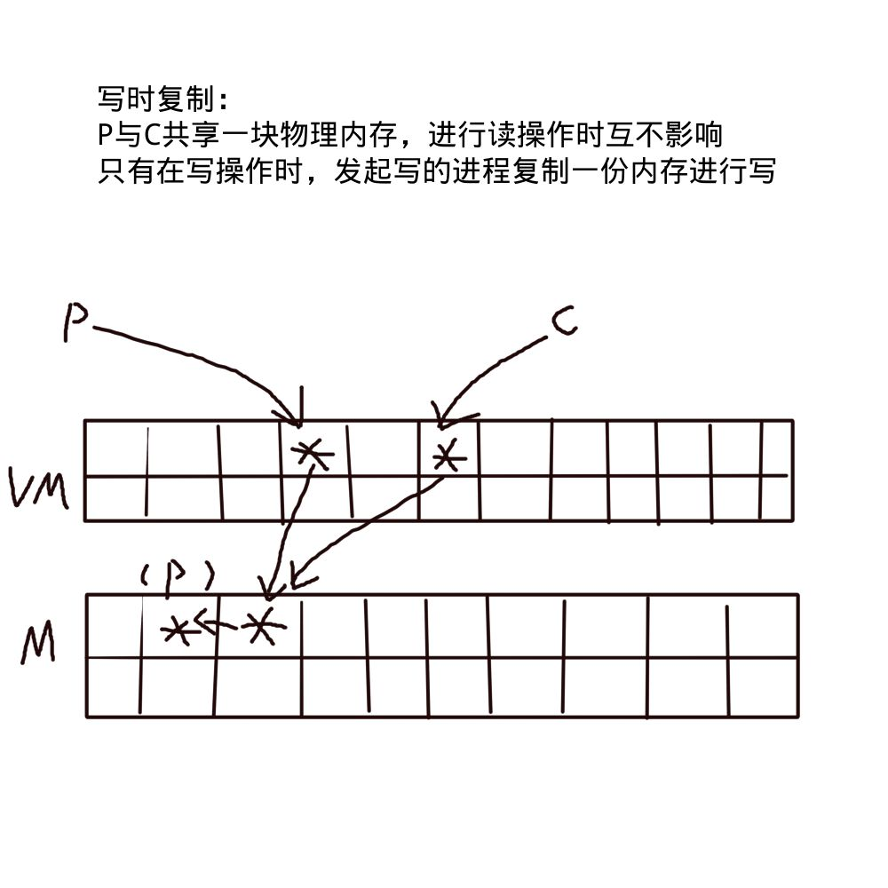
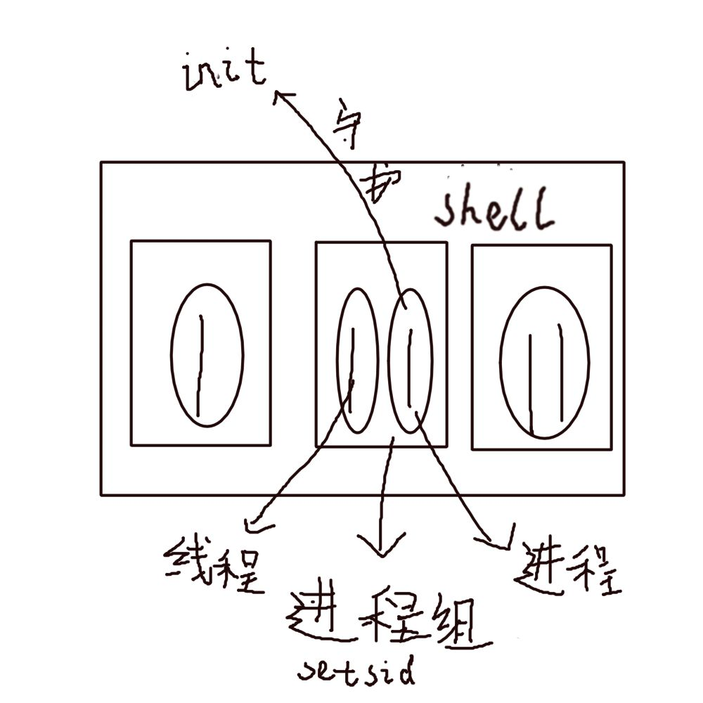

## 进程
-  
#### 进程状态

### 进程标识符pid
### 进程的产生
- duplicating 意味着拷贝 克隆
- fork后父子进程的区别
	- fork的返回值不一样
	- pid不一样
	- ppi也不同
	- 未决信号和文件锁不继承
	- 资源利用量清零
- init进程：1号进程，是所有进程的祖先进程
- 调度器 的调度策略来决定哪个进程先运行
- fflush()刷新缓冲区
- 
### 进程的消亡及释放资源
wait()
waitpid()
### exec函数族
~~~c
#include <glob.h>
#include <stdio.h>
#include <stdlib.h>
#include <string.h>
#include <sys/wait.h>
#include <unistd.h>

#define DELIMS " \t\n"

struct cmd_st {
glob_t globres;
};

static void prompt(void)
{
printf("ysh-0.1$ ");
}

static void parse(char* line, struct cmd_st* cmd)
{
char* tok;
int flag = 0;

while (1) {
tok = strsep(&line, DELIMS);
if (tok == NULL)
break;
if (tok[0] == '\0')
continue;

glob(tok, GLOB_NOCHECK | GLOB_APPEND * flag, NULL, &cmd->globres);
flag = 1;
}
}

int main()
{

char* linebuf = NULL;
struct cmd_st cmd;
size_t linebuf_size = 0;
pid_t pid;

while (1) {
prompt();

if (getline(&linebuf, &linebuf_size, stdin)) {
}

parse(linebuf, &cmd);

if (0) {

} else {
pid = fork();
if (pid < 0) {
perror("fork()");
exit(1);
}
if (pid == 0) {
execvp(cmd.globres.gl_pathv[0], cmd.globres.gl_pathv);
perror("execvp()");
exit(1);
} else {
wait(NULL);
}
}
}
exit(0);
}

~~~
### 用户权限及组权限
~~~c
#include <stdio.h>
#include <stdlib.h>
#include <sys/wait.h>
#include <unistd.h>

int main(int argc, char** argv)
{
if (argc < 3) {
fprintf(stderr, "Useage...\n");
exit(1);
}

pid_t pid;

pid = fork();
if (pid < 0) {
perror("fork()");
exit(1);
}
if (pid == 0) {
setuid(atoi(argv[1]));
execvp(argv[2], argv + 2);
perror("execvp()");
exit(1);
}

wait(NULL);
exit(0);
}

~~~
### 观摩课：解释器文件
### system()
fork() exec() wait() 的封装
### 进程会计
### 进程时间
### 守护进程
#### ession(会话)
- 
- 标识sid
- setsid()
- getpgrp()//return the process group ID of the calling process
- getpgid()
- setpgid()
#### 示例
~~~c
#define FNAME "/tmp/out"

static int daemonize(void)
{
int fd;
pid_t pid;

pid = fork();
if (pid < 0) {
perror("fork()");
return -1;
}
if (pid > 0) //父进程
exit(0);

if (pid > 0)
exit(0);

fd = open("/dev/null", O_RDWR);
if (fd < 0) {
perror("open()");
return -1;
}

dup2(fd, 0);
dup2(fd, 1);
dup2(fd, 2);
if (fd > 2) {
close(fd);
}

setsid();

chdir("/");
return 0;
}

int main(void)
{
FILE* fp;

if (daemonize())
exit(1);
fp = fopen(FNAME, "w");
if (fp == NULL) {
perror("fopen()");
exit(1);
}

for (int i = 0;; i++) {
fprintf(fp, "已运行 %d s\n", i);
fflush(fp);
sleep(1);
}
exit(0);
}

~~~
### 系统日志
