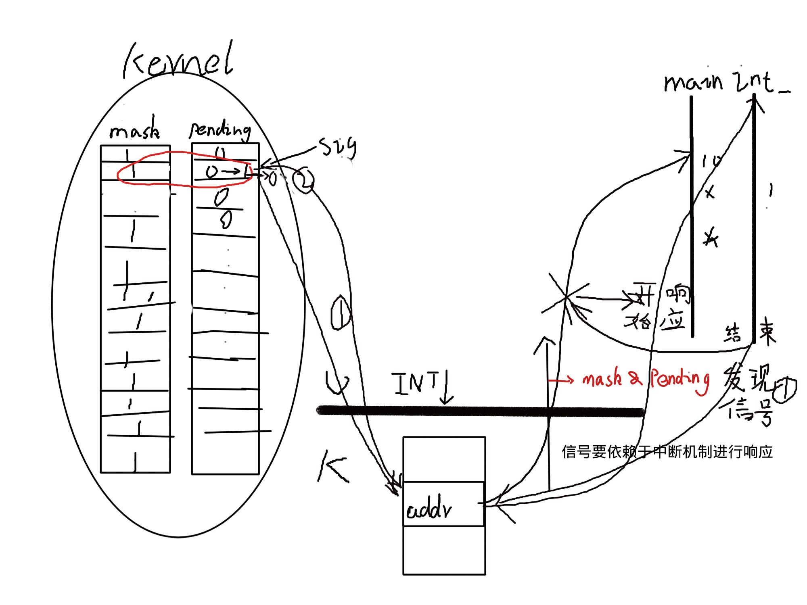
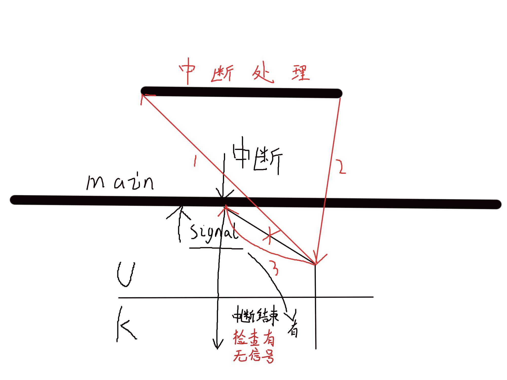

# 并发
## 同步
## 异步
- 异步事件的处理(钓鱼)
	- 查询————数据量大
	- 通知(伪通知)———— 数据量小
# 信号
## 信号的概念
信号是软件的中断
## signal()
~~~c
void (*signal(int signum,void (*func)(int)))(int)

void (int) * signal (int signal,void (int)* func)

typedef void (*sighandler_t)(int);
sighandler_t signal(int signum,sighandler_t handler)
~~~

- **信号会打断阻塞的系统调用**
	~~~c
	do {
	sfd = open(argv[1],O_RDONLY);
	if(sfd<0)
	{
	if(error != EINTR){
	perror("open()");
	exit(1);
	}
	}
	}while(sfd<0);

	~~~
## 信号的不可靠
信号行为的不可靠
## 可重入函数
- **第一次调用还没有结束，然后就发生了第二次调用，但是不会出错**
- **所有的系统调用都是可重入的，一部分库函数也是可重入的,如 memcpy**
- **只要库函数有func_r 版本源函数就不能用于信号处理函数中（防止重入），且源函数是存放在静态区的**
## 信号的响应过程
### 信号和中断的相似点
- 都采用了异步通信的方式.
	- 同步就是排队, 信息一个接一个的处理, 异步就是插队
- 都是暂停当前的, 去执行对应的handle程序
- 都是处理完返回原来位置
- 对于信号和中断, 都是可以屏蔽的

### 信号与中断的区别
- 中断有优先级, 信号没有
- 信号处理程序在用户态下运行的, 中断程序在核心态下运行的
- 中断响应是及时的, 当信号响应一般有延迟
### 信号的使用
#### 信号的功能
- 发送信号
- 预置对信号的处理方式
- 收受信号的进程an预置完成对应处理
#### 信号的发送
- 由发送进程把信号送到指定进程的信号域的某一位上. 如果指定基础正在一个可被中断的优先级上睡眠, 核心便将其叫醒, 发送进程就此结束
	- 一个进程的信号域可以有多个信号位被置位
	- 一个信号位只处理当前最后的信号handle
	- 进程用kill(pid,signum)发送信号位
### 信号的处理时间
##### 检查软中断:
- 进入或退出低优先级睡眠状态
- 进程即将从核心态返回用户态时
##### 不理睬软中断
- 进程处于核心态
##### 处理软中断
- 只在用户态下处理
### 信号处理方式
- 忽略软中断 SIG_IGN
- 收到软中断就退出 SIG_DFL
- 收到软中断跳转到对应函数
	
- **信号从收到到相应有不可避免的延迟**
- 
#### 思考
###### 如何忽略掉一个信号
|mask|pending|状态|
|:--:|:-----:|:--:|
|1|0|U|
|1|1|接到信号,暂时不响应，中断来临(进入或退出低优先级睡眠状态 抑或是U->K)|
|1|1|调度器将进程调上cpu K->U 发现信号|
|0|0|U(用响应函数替换main，执行响应机制)|
|1|0|响应结束，重新将mask位置1,并进行检查，如果没有信号则继续执行main|
######  标准信号为什么要丢失
- **标准信号的响应没有严格的顺序**
## 常用函数
#### kill()
**send signal to a process**
~~~c
#include <sys/types.h>
#include <signal.h>

If  pid  is  positive(+), then signal sig is sent to the process with the ID specified by
pid.(指定)

If pid equals 0, then sig is sent to every process in the process group of the calling
process.(组内广播)

If  pid equals -1, then sig is sent to every process for which the calling process has
permission to send signals, except for process 1 (init), but see below.(init的全局广播，比如关机时的解除挂载)

If pid is less than -1, then sig is sent to every process in the process  group  whose
ID is -pid.(发送给|gpid| == |pid|的进程)

If  sig  is  0,  then no signal is sent, but existence and permission checks are still
performed; this can be used to check for the existence of  a  process  ID  or  process
group ID that the caller is permitted to signal.
raise()
~~~
### 计时信号

#### alarm()

#### 令牌桶

~~~c
struct mytbf_st {
int cps;
int burst;
int token;
int pos;
};

typedef void (*sighandler_t)(int);

static struct mytbf_st* job[MYTBF_MAX];
static int inited = 0;
static sighandler_t alrm_handler_save;

static void alrm_handler(int s)
{
alarm(1); //???(为下一秒的时钟信号做铺垫,构成alarm链)
for (int i = 0; i < MYTBF_MAX; i++) {
if (job[i] != NULL) {
job[i]->token += job[i]->cps;
if (job[i]->token > job[i]->burst)
job[i]->token = job[i]->burst;
}
}
}

static void moude_unload(void)
{
signal(SIGALRM, alrm_handler_save);
alarm(0);
for (int i = 0; i < MYTBF_MAX; i++)
free(job[i]);
}

static void moude_load(void)
{
signal(SIGALRM, alrm_handler);
alarm(1);

atexit(moude_unload);
}

static int get_free_pos(void)
{
for (int i = 0; i < MYTBF_MAX; i++) {
if (job[i] == NULL)
return i;
}
return -1;
}

mytbf_t* mytbf_init(int cps, int rst)
{
struct mytbf_st* me;
int pos;

//init只能初始化一次令牌数组，因为alarm只能出现一次
if (!inited) {
moude_load();
inited = 1;
}

get_free_pos();
if (pos < 0)
return NULL;

me = malloc(sizeof(*me));
if (me == NULL) {
return NULL;
}
me->token = 0;
me->cps = cps;
me->burst = cps;
me->pos = pos;

job[pos] = me;

return me;
}

int mytbf_fetchtoken(mytbf_t* ptr, int size)
{
struct mytbf_st* me = ptr;
if (size <= 0)
return -EINVAL;

while (me->token <= 0)
pause();

int n = me->token <= size ? me->token : size;
me->token -= n;
return n;
}

int mytbf_returntoken(mytbf_t* ptr, int size)
{
struct mytbf_st* me = ptr;

if (size <= 0)
return -EINVAL;

me->token += size;
if (me->token > me->burst)
me->token = me->burst;

return size;
}

int mytbf_destrory(mytbf_t* ptr)
{
struct mytbf_st* me = ptr;
job[me->pos] = NULL;
free(ptr);

return 0;
}

~~~

~~~c
#include "mytbf.h"
#include <stdio.h>
#include <stdlib.h>

#define CPS 10
#define BUFSIZE 1024
#define BURST 100

int main(int argc, char* argv[])
{
int sfd, dfd = 1; //源文件 目标文件
char buf[BUFSIZ];
int len, ret, pos, size;
mytbf_t* tbf;

if (argc < 2) {
fprintf(stderr, "Usage...\n");
exit(1);
}

tbf = mytbf_init(CPS, BURST);

do {
sfd = open(argv[1], O_RDONLY);
if (sfd < 0) {
if (errno != EINTR) {
perror("open()");
exit(1);
}
}
} while (sfd < 0);

while (1) {

size = mytbf_fetchtoken(tbf, BUFSIZE);
if (size < 0) {
fprintf(stderr, "fetcherr:%s\n", strerror(-size));
exit(1);
}

while ((len = read(sfd, buf, size)) < 0) {

if (errno == EINTR)
continue;
perror("read()");
break;
}
if (len == 0)
break;

if (size - len > 0)
mytbf_returntoken(tbf, size - len);

pos = 0;
while (len > 0) {
ret = write(dfd, buf + pos, len);
if (ret < 0) {
if (errno == EINTR)
continue;
perror("write()");
exit(1);
}
pos += ret;
len -= ret;
}
sleep(1);
}
close(sfd);
mytbf_destrory(tbf);

exit(0);
}
~~~

#### 实时计时器

~~~c

~~~

#### setitime()

~~~c
#include <asm-generic/errno-base.h>
#include <errno.h>
#include <fcntl.h>
#include <signal.h>
#include <stdio.h>
#include <stdlib.h>
#include <sys/stat.h>
#include <sys/time.h>
#include <sys/types.h>
#include <unistd.h>

#define CPS 10
#define BUFSIZE CPS
#define BURST 100

static volatile int token = 0;

static void alrm_handler(int s)
{
token++;
if (token > BURST)
token = BURST;
}

int main(int argc, char* argv[])
{
int sfd, dfd = 1; //源文件 目标文件
char buf[BUFSIZ];
int len, ret, pos;
struct itimerval itv;

if (argc < 2) {
fprintf(stderr, "Usage...\n");
exit(1);
}

signal(SIGALRM, alrm_handler);

itv.it_interval.tv_sec = 1;
itv.it_interval.tv_usec = 0;
itv.it_value.tv_sec = 1;
itv.it_value.tv_usec = 0;

setitimer(ITIMER_REAL, &itv, NULL);

do {
sfd = open(argv[1], O_RDONLY);
if (sfd < 0) {
if (errno != EINTR) {
perror("open()");
exit(1);
}
}
} while (sfd < 0);

while (1) {

if (token <= 0)
pause();
token--;

while ((len = read(sfd, buf, BUFSIZE)) < 0) {

if (errno == EINTR)
continue;
perror("read()");
break;
}
if (len == 0)
break;

pos = 0;
while (len > 0) {
ret = write(dfd, buf + pos, len);
if (ret < 0) {
if (errno == EINTR)
continue;
perror("write()");
exit(1);
}
pos += ret;
len -= ret;
}
sleep(1);
}
close(sfd);

exit(0);
}
~~~

#### pause()
#### abort()
#### system()
#### sleep()

#### nanosleep()

#### usleep()

#### select()

## 信号集
- 信号集类型 :sigset_t
	- sigenptyset()
	- sigfillset()
	- sigaddset()
	- sigdelset()
	- sigismember()
## 信号屏蔽字/pending集的处理
- sigprocmask()//控制mask位图
	
	~~~c
	#include <signal.h>
	#include <stdio.h>
	#include <stdlib.h>
	#include <unistd.h>
	
	void int_handler(int s)
	{
	    write(1, "?", 1);
	}
	#if 0
	
	#endif
	int main()
	{
	    //mask一开始全1
	    sigset_t set, o_set, save_set;
	    signal(SIGINT, int_handler);
	    sigemptyset(&set);       //添加一个新的空信号集
	    sigaddset(&set, SIGINT); //将SIGINT信号加入信号集 000010000000....
	
	    sigprocmask(SIG_UNBLOCK, &set, &save_set); //mask = 11110111111... & old_mask
	                                               //save_set = old_mask
	    sigprocmask(SIG_BLOCK, &set, &o_set);      //mask = 000010000...| old_mask
	                                               //o_set = old_mask
	
	    for (int i = 0; i < 1000; i++) {
	        for (int j = 0; j < 5; j++) {
	            write(1, "*", 1);
	            sleep(1);
	        }
	        write(1, "\n", 1);
	        sigsuspend(&o_set); //等待阻塞信号集
	#if 0
	        sigset_t tmpset;
	        sigprocmask(SIG_SETMASK, &o_set, &tmpset);//tmpset = o_set
	        //SIG_SETMASK The set of blocked signals is set to the argument set.
	        pause();
	        sigprocmask(SIG_SETMASK, &tmpset, NULL);
	#endif
	    }
	    sigprocmask(SIG_SETMASK, &save_set, NULL); //无意义
	    exit(0);
	}
	~~~
	
	
## 扩展

