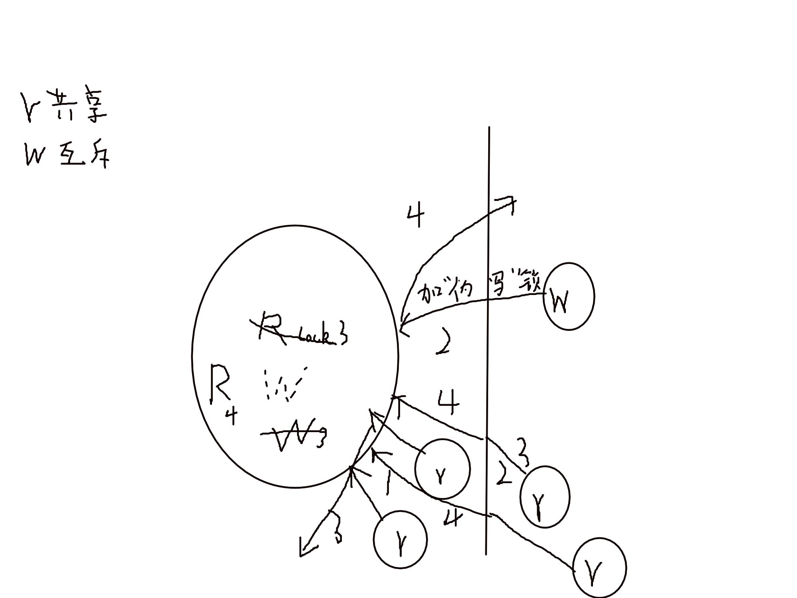

# 线程
## 线程的概念
 - 一个正在的函数
- posix线程是一套标准，而非实现
- openmp线程
- **线程标识 pthread_t**
	- pthread_equal();
	- pthread_self();
## 线程基础
### 创建
- pthread_create()
	~~~c
	static void *func(void* p){
	puts("Thread is working!");
	return NULL;
	}
	int main(){
	pthread_t tid;
	int er;

	puts("Begin!");

	err = pthread_create(&tid,NULL,.func,NULL);

	if(err){
	fprintf(stderr,"pthread_create():%s\n",strerror(err));
	exit(1);
	}

	puts("Ends");
	exit(0);
	}
	~~~
### 终止
- 线程从启动例程返回，返回值就是线程的退出码
- 线程可以被同一进程中的其他线程取消
- 线程调用pthread_exit()函数
###### 示例
~~~c
static void *func(void *p){
puts("Thread is working!");
pthread_exit(NULL);
}
~~~
### 清理
~~~c
int pthread_join(pthread_t thread,void **retval);

int main(){
...
	if(err){
		fprintf(stderr,"pthread_create():%s\n",strerror(err));
		exit(1);
	}

	pthread_join(tid,NULL);//不关心最终状态，只是回收

	puts("Ends");
}
~~~
#### 栈的清理
~~~c
void pthread_cleanuo_push(void (8routine)(void *),void *arg);
void pthread_cleanup_pop(int execute);

static void *func(void *p)
{
	puts("Thread is working!");

	//push 和pop不是函数 是宏 一定要匹配 放在哪里都可以 不一定能执行到 但没有会过不了语法检查
	pthread_cleanup_push(claenup_func,"cleanup:1");
	pthread_cleanup_push(claenup_func,"cleanup:1");
	pthread_cleanup_push(claenup_func,"cleanup:1");

//pthread_exit(NULL); pop按照全1处理

//逆序执行 1执行 0取出但不执行
	pthread_cleanup_pop(1);
	pthread_cleanup_pop(0);
	pthread_cleanup_pop(0);

	pthread_exit(NULL);
}

static void cleanup_func(void *p)
{
	puts(p);
}

int main()
{
	...
	if(err){
		fprintf(stderr,"pthread_create():%s\n",strerror(err));
		exit(1);
	}

	pthread_join(tid,NULL);//不关心最终状态，只是回收

	puts("Ends");
}
~~~
### 取消选项
~~~c
pthread_cancel();
~~~
- 线程取消有2中状态
	- 允许
	- 不允许
- 允许取消又分为
	- 异步cancel

	- 推迟cancek(default)

		- **推迟至cancel点在响应cancel点 POSIX定义的cancle点 都是肯呢个引发阻塞的系统调用**

		~~~c
		pthread_setcancelstate() : 是指是否允许取消
		pthread_setcanceltype() : 设置取消方式
		pthread_testcancel() : 本函数什么都不做 就是一个取消点
		~~~
#### 线程分离
~~~c
pthread_detach();
~~~
## 线程同步
### 互斥量
~~~c
pthread_mutex_t
pthread_mutex_init()
pthread_mutex_destroy()
pthread_mutex_lock()
pthread_mutex_trylock()
pthread_mutex_unlock()
~~~
##### 任务池
~~~c
#include <pthread.h>
#include <sched.h>
#include <stdio.h>
#include <stdlib.h>
#include <string.h>
#define LEFT 30000000
#define RIGHT 30000200
#define THRNUM 4

static int num = 0;
static pthread_mutex_t mut_num = PTHREAD_MUTEX_INITIALIZER;

static void* thr_primer(void* p)
{
    int i, flag;
    pthread_mutex_lock(&mut_num);
    while (1) {
        pthread_mutex_unlock(&mut_num);
        while (num == 0) {
            pthread_mutex_unlock(&mut_num);
            sched_yield(); //出让调度器
            pthread_mutex_lock(&mut_num);
        }

        if (num == -1) {
            pthread_mutex_unlock(&mut_num);
            break;
        }

        i = num;
        num = 0;
        pthread_mutex_unlock(&mut_num); //释放num

        flag = 1;
        for (int j = 2; j < i / 2; j++) {
            if (i % j == 0) {
                flag = 0;
                break;
            }
        }
        if (flag)
            printf("%d is a primer\n", i);
    }
    pthread_exit(p);
}

int main(void)
{
    int err;
    pthread_t tid[THRNUM];
    for (int i = 0; i < THRNUM; i++) {
        err = pthread_create(tid + i, NULL, thr_primer, (void*)i);
        if (err) {
            fprintf(stderr, "pthread_create(:%s\n)", strerror(err));
            exit(1);
        }
    }

    //下发任务
    for (int i = LEFT; i <= RIGHT; i++) {
        pthread_mutex_lock(&mut_num);
        while (num != 0) {
            pthread_mutex_unlock(&mut_num);
            sched_yield(); //出让调度器
            pthread_mutex_lock(&mut_num);
        }
        num = i; //下发任务
        pthread_mutex_unlock(&mut_num);
    }

    //检查是否结束
    pthread_mutex_lock(&mut_num);
    while (num != 0) {
        pthread_mutex_unlock(&mut_num);
        sched_yield(); //出让调度器
        pthread_mutex_lock(&mut_num);
    }
    num = -1; //结束线程
    pthread_mutex_unlock(&mut_num);

    for (int i = 0; i < THRNUM; i++) {
        pthread_join(tid[i], NULL);
    }

    pthread_mutex_destroy(&mut_num);
    exit(0);
}

~~~
#### pthread_once 动态模块的单次初始化函数
~~~c
pthread_once(pthread_once_t *once_control,
void (*init_routine)(void));

~~~
##### 多线程版令牌桶
~~~c
struct mytbf_st {
    int cps;
    int burst;
    int token;
    int pos;
    pthread_mutex_t mut;
};

static struct mytbf_st* job[MYTBF_MAX];
static pthread_mutex_t mut_job = PTHREAD_MUTEX_INITIALIZER;
static pthread_once_t init_once;
static pthread_t tid;

static void* thr_alrm(void* p)
{
    while (1) {
        pthread_mutex_lock(&mut_job);
        for (int i = 0; i < MYTBF_MAX; i++) {
            if (job[i] != NULL) {
                pthread_mutex_lock(&job[i]->mut);
                job[i]->token += job[i]->cps;
                if (job[i]->token > job[i]->burst)
                    job[i]->token = job[i]->burst;
                pthread_mutex_unlock(&job[i]->mut);
            }
        }
        pthread_mutex_unlock(&mut_job);
        sleep(1);
    }
}

static void moude_unload(void)
{
    pthread_cancel(tid);
    pthread_join(tid, NULL);

    for (int i = 0; i < MYTBF_MAX; i++)
        free(job[i]);

    pthread_mutex_destroy(&mut_job);
}

static void moude_load(void)
{
    int err;

    err = pthread_create(&tid, NULL, thr_alrm, NULL);
    if (err) {
        fprintf(stderr, "pthread_create():%s\n", strerror(errno));
        exit(1);
    }
    atexit(moude_unload);
}

static int get_free_pos_unlocked(void)
{
    for (int i = 0; i < MYTBF_MAX; i++) {
        if (job[i] == NULL)
            return i;
    }
    return -1;
}

mytbf_t* mytbf_init(int cps, int rst)
{
    struct mytbf_st* me;
    int pos;

    pthread_once(&init_once, moude_load);
    me = malloc(sizeof(*me));
    if (me == NULL) {
        return NULL;
    }
    me->token = 0;
    me->cps = cps;
    me->burst = cps;
    pthread_mutex_init(&me->mut, NULL);

    pthread_mutex_lock(&mut_job);
    pos = get_free_pos_unlocked();
    if (pos < 0) {
        pthread_mutex_unlock(&mut_job);
        return NULL;
    }

    me->pos = pos;
    job[pos] = me;

    pthread_mutex_unlock(&mut_job);

    return me;
}

int mytbf_fetchtoken(mytbf_t* ptr, int size)
{
    struct mytbf_st* me = ptr;
    if (size <= 0)
        return -EINVAL;

    pthread_mutex_lock(&me->mut);
    while (me->token <= 0) {
        pthread_mutex_unlock(&me->mut);
        sched_yield();
        pthread_mutex_lock(&me->mut);
    }

    int n = me->token <= size ? me->token : size;
    me->token -= n;
    pthread_mutex_unlock(&me->mut);

    return n;
}

int mytbf_returntoken(mytbf_t* ptr, int size)
{
    struct mytbf_st* me = ptr;

    if (size <= 0)
        return -EINVAL;

    pthread_mutex_lock(&me->mut);
    me->token += size;
    if (me->token > me->burst)
        me->token = me->burst;
    pthread_mutex_unlock(&me->mut);

    return size;
}

int mytbf_destrory(mytbf_t *ptr)
{
    struct mytbf_st* me = ptr;

    pthread_mutex_lock(&mut_job);
    job[me->pos] = NULL;
    pthread_mutex_unlock(&mut_job);
    pthread_mutex_destroy(&me->mut);
    free(ptr);

    return 0;
}
~~~
### 查询法

#### 条件变量
~~~c
pthread_cont_t
pthread_cont_init();
pthread_cond_destroy();

pthread_cond_broadcast();//广播
pthread_cond_signal();

//时间相关
pthread_cont_timedwait();
pthread_cond_wait();
~~~

~~~c
#include "mysem.h"
#include <stdio.h>
#include <stdlib.h>

#define LEFT 30000000
#define RIGHT 30000200
#define THRNUM RIGHT - LEFT
#define N 4

static mysem_t *sem;

static void *thr_primer(void *p) {
  int i = (int)p;
  int flag = 1;
  for (int j = 2; j < i / 2; j++) {
    if (i % j == 0) {
      flag = 0;
      break;
    }
  }
  if (flag)
    printf("%d is a primer\n", i);

  sleep(3);
  mysem_add(sem, 1);
  pthread_exit(p);
}

int main(void) {
  int err;
  pthread_t tid[THRNUM];

  sem = mysem_init(N);
  if (sem == NULL) {
    fprintf(stderr, "mysem_init faild!\n");
    exit(1);
  }

  for (int i = LEFT; i <= RIGHT; i++) {
    mysem_sub(sem, 1);
    err = pthread_create(tid + (i - LEFT), NULL, thr_primer, (void *)i);
    if (err) {
      fprintf(stderr, "pthread_create(:%s\n)", strerror(err));
    }
  }

  for (int i = LEFT; i <= RIGHT; i++) {
    pthread_join(tid[i - LEFT], NULL);
  }

  mysem_destroy(sem);
  exit(0);
}

~~~

~~~c
#include "mysem.h"
#include <pthread.h>
#include <stdio.h>
#include <stdlib.h>
struct mysem_st {
  int value;
  pthread_mutex_t mut;
  pthread_cond_t cond;
};
mysem_t *mysem_init(int initval){
        struct mysem_st *me;
        me = malloc(sizeof(*me));
        if(me == NULL)
          return NULL;

        me->value = initval;
        pthread_mutex_init(&me->mut,NULL);
        pthread_cond_init(&me->cond,NULL);
        return me;
}

//还资源量
int mysem_add(mysem_t *ptr, int n){
        struct mysem_st *me = ptr;

        pthread_mutex_lock(&me->mut);
        me->value += n;
        pthread_cond_broadcast(&me->cond);
        pthread_mutex_unlock(&me->mut);

        return n;
}
//申请资源量
int mysem_sub(mysem_t *ptr, int n){
        struct mysem_st *me = ptr;

        pthread_mutex_lock(&me->mut);

        while(me->value < n)
          pthread_cond_wait(&me->cond,&me->mut);

        me->value -= n;
        pthread_mutex_unlock(&me->mut);

        return n;
}

int mysem_destroy(mysem_t *ptr){
        struct mysem_st *me = ptr;
        pthread_mutex_destroy(&me->mut);
        pthread_cond_destroy(&me->cond);
        free(me);

        return 0;
}

~~~

#### 读写锁

## 线程属性

~~~c
pthread_attr_init();
pthread_atrr_destroy();
~~~

## 重入
### 多线程中的IO
### 线程与信号
~~~c
pthread_sigmask();
sigwait();
pthread_kill();
~~~
### 线程与fork
