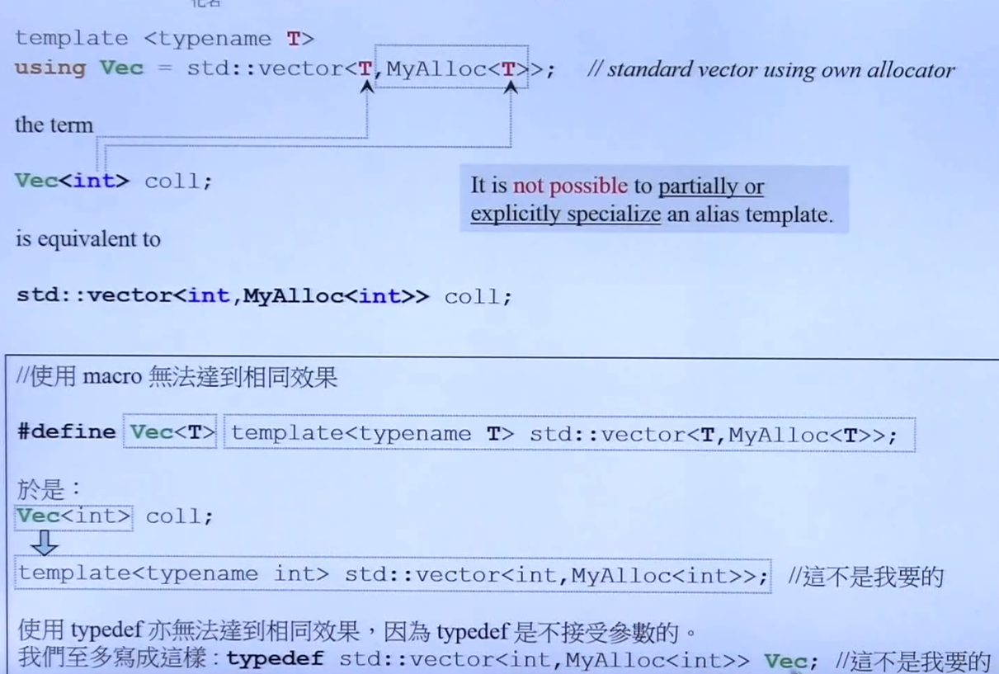

# C++2.0新特性

# 语法

## Variadic Templates

数量不定的模板参数 **非常适合用来做递归**

``` c++
#include <iostream>

using namespace std;

namespace VariadicTemplates{
  void printX() {

  }

  template <typename T, typename... Types>
  void printX(const T& firstArg, const Types&... args) {
    cout << firstArg << endl;
    printX(args...);
  }
}

int main(int argc, char *argv[]) {
  VariadicTemplates::printX(1.2, 1, "gg");
  return 0;
}


```


``` c++
// Max/Min
int maximum(int n) { return n; }

template <typename... Args> int maximum(int n, Args... args) {
  return max(n, maximum(args...));
}

```


``` c++
// 模拟tuple内部实现
template <typename... Values> class _tuple; // 这里表示_tuple是一个模板类

template <> class _tuple<> {
public:
  _tuple() {}
};

template <typename Head, typename... Tail> //不希望产生实参个数为0的变长参数模板
class _tuple<Head, Tail...> : private _tuple<Tail...> //继承自参数少一个的tuple
{
  typedef _tuple<Tail...> inherited;

protected:
  Head m_head;

public:
  _tuple() = default;
  _tuple(Head v, Tail... vtail) : m_head(v), inherited(vtail...) {}

  auto head() -> decltype(m_head) { return m_head; } //使用decltype进行类型推导
  //	Head head(){ return m_head; }
  inherited &tail() { return *this; } // return后转换为inherited
};


int main(int argc, char *argv[]) {
  VariadicTemplates::_tuple<int,float,string> t(41,6.3,"nico");
  cout << t.head() <<endl;
  cout << t.tail().head() <<endl;
  cout << t.tail().tail().head() <<endl;
  return 0;
}


```

## 一下小改动

### <<> > 与 <<>>

### nullptr and std::nullptr_t

### auto

``` c++
auto int i = 32; // 这个c++11不允许这样使用了

auto i = 32;
```

`auto` 用在太长、太复杂的类型名的推导 

``` c++
list<string> c;

list<string>::iterator ite;
ite = find(c.begin(), c.end(), target);
```

``` c++
list<string> c;
auto ite = find(c.begin(), c.end(), target);
```

## Uniform Initialization

``` c++
int values[] {1, 2, 3}; # 1
vector<int> v {2, 3, 5, 6, 7};
vector<string> cities {
    "Berlin", "New York", "BeiJing"
}; # 2
complex<double> c{1.0, 2.0}; # 3
```

- # 1  这里其实是利用了一个事实：编译器看到{t1, t2, t3...}便做出一个initializer_list<T>，它关联至一个array<T, n>。调用函数(ctor)时该array内的元素可以被编译器分解注逐一传给函数，但如果函数参数是一个`initializer_list<T>` ,调用者不可以给予数个T参数而认为编译器会自动包装成`initializer_list`然后传入
- # 2 这里形成一个`initializer_list<string>` ，背后有个`array<string, 6>`。调用vector<string> ctors时编译器找到了一个`vector<string> vector(initializer_list<string>)` 注意所有的容器都有这个构造函数
- # 3  这里形成一个`initializer_list<double>` ，背后有个`array<double, 2>`。调用complex<double> ctor时将该array中的2个元素分解传给ctor， complex<double>并没有任何ctor接受initializer_list<double>

## Initializer Lists

``` c++
int i; // 没有初值
int j{}; // j == 0
int *p; // 没有初值
int *q{}; // q == nullptr
```

### initializer_list<> 使用

``` c++

namespace Initializer_list {
  void print(initializer_list<int> vals) {
    for (auto p = vals.begin();p != vals.end();++p) {
      cout << *p << "\n";
    }
  }
};


int main(int argc, char *argv[]) {
  Initializer_list::print({1, 2, 3, 4, 5});
  return 0;
}

```

> 看一下调用规则

``` c++
namespace Initializer_list {
class P {
public:
  P(int a, int b) { cout << "P(int, int), a=" << a << ", b=" << b << endl; }

  P(initializer_list<int> initlist) {
    cout << "P(initializer_list<int>), value=";
    for (auto i : initlist) {
      cout << i << " ";
    }
    cout << "\n";
  }
};
}; // namespace Initializer_list

int main(int argc, char *argv[]) {
  Initializer_list::P p(11, 12);
  Initializer_list::P q{11, 12};
  Initializer_list::P r{11, 12, 13};
  Initializer_list::P s = {11, 12, 13, 14};
  return 0;
}
```

### 实现

``` c++
template <calss E>
class initializer_list
{
public:
    typedef _E vcalue_type;
    typedef const _E& reference;
    typedef const _E& const_reference;
    typedef size_t size_type;
    typedef const _E* iterator;
    typedef const _E* const_iterator;

private:
    iterator _M_array;
    size_type _M_len;
    
    // 编译器可以调用这个私有的构造函数
    constexpr initializer_list(const_iterator __a, size_type __l) : _M_array(__a), _M_len(__l) {}
    
public:
    constexpr initializer_list() constexpr : _M_array(0), _M_len(0) {}
    constexpr size_type size() const constexpr : _M_array(0), _M_len(0) {}
    constexpr begin() const constexpr {
        return _M_array;
    }
    constexpr end() const constexpr {
        return begin();
    }
};
```


## explicit

``` c++

namespace Explicit {
  class P
  {
  public:
    P(int a, int b) {
      cout << "P(int a, int b)" << endl;
    }

    P(initializer_list<int>) {
      cout << "P(initializer_list<int>)" << endl;
    }

    explicit P(int a, int b, int c) {
      cout << "explicit P(int a, int b, int c)"<< endl;
    }
  };

  void fp(const P&) {};
};

int main(int argc, char *argv[]) {
  Explicit::P p1(1, 2);
  Explicit::P p2{1, 2};
  Explicit::P p3{1, 2, 3};
  Explicit::P p4 = {1, 2};
  Explicit::P p5 = {1, 2, 3};
  Explicit::P p6(1, 2, 3);

  Explicit::fp({1, 2});
  Explicit::fp({1, 2, 3});
  Explicit::fp(Explicit::P{1, 2});
  Explicit::fp(Explicit::P(1, 2));

  return 0;
}

```


## range-based for statement

``` c++

for (auto i : {1, 2, 3, 4, 5, 6, 7}) {
    cout << i << endl;
}

for (auto& i : {1, 2, 3, 4, 5, 6, 7}) {
    cout << i << endl;
}

for (const auto& i : {1, 2, 3, 4, 5, 6, 7}) {
    cout << i << endl;
}

int main(int argc, char *argv[]) {

  vector<int> v{1, 2, 3, 4, 5, 6, 7};
  for (auto i : v) {
    i*=3;
    cout << i << endl;
  }
  for (const auto &i : v) {
    cout << i << endl;
  }
  return 0;
}

```


## =default =delete
如果你自行定义了一个ctor，那么编译器接不会再给你一个default ctor

如果你强制加上 =default，就可以重新获得并使用default ctor

``` c++
  class Zoo
  {
    public:
    Zoo(int i1, int i2) : d1(i1), d2(i2) {}
    Zoo(const Zoo&)=delete;
    Zoo(Zoo&&)=default;
    Zoo& operator=(const Zoo&)=default;
    Zoo& operator=(const Zoo&&)=delete;
    virtual ~Zoo() {}
  private:
    int d1, d2;

 };

```

- =default 用于BigFive 之外没有意义 会报错
- =delete 可以用于任何函数身上(=0 只能用于virtual函数)
- 类中包含引用或指针需要定义Big Three /Big Five

``` c++
class noncopyable
{
protected:
    noncopyable() {}
    ~noncopyable() {}
private:
    noncopyable(const noncopyable&);
    const noncopyable& operator=(const noncopyable&);
}

typedef noncopyable_::noncopyable noncopyable;
```

## Alias Template



- 不可以对 AliasTemplate 使用模板偏特化


## template template parameter

``` c++
namespace Explicit {
class P {
public:
  P(int a, int b) { cout << "P(int a, int b)" << endl; }
  P() { cout << "P()" << endl; }

  P(initializer_list<int>) { cout << "P(initializer_list<int>)" << endl; }

  explicit P(int a, int b, int c) {
    cout << "explicit P(int a, int b, int c)" << endl;
  }
};

void fp(const P &){};
}; // namespace Explicit

namespace temptempparam {
#define SIZE 3000000
template <typename T, template <class> class Container> class XCls {
private:
  Container<T> c;

public:
  XCls() { // ctors
    for (long i = 0; i < SIZE; ++i) {
      c.insert(c.end(), T());
    }
    cout << "构造完毕" << endl;
  }
};
}; // namespace temptempparam

template <typename T> using Vec = vector<T, allocator<T>>;

int main(int argc, char *argv[]) {
  temptempparam::XCls<Explicit::P, Vec> c1;
  return 0;
}

```

## decltype

可以认为是 `typeof()`

``` c++
namespace Decltype {
template <typename T1, typename T2> auto add(T1 x, T2 y) -> decltype(x + y);
void test() {
  vector<int> v;
  decltype(v)::value_type elem;
  cout << elem << endl;
}
}; // namespace Decltype

```

> 配合lambdas 使用

``` c++
auto cmp = [](const Person& p1, const Person& p2) {
    return p1.lastname() < p2.lastname() ||
    (p1.lastname() == p2.lastname() && p1.lastname() < p2.firstname())
}

std::set<>Person, decltype(cmp) > coll(cmp);
```

## Lambdas
inline functionality

匿名函数

### 概览

``` c++
[] {
    std::cout << "hello" << std::endl;
}

[] {
    std::cout << "hello lambda" << std::endl;
}()

autp l = [] {
    std::cout << "hello lambda" << std::endl;
}

l();
```


### 形式

``` c++
[...获取外部变量](...函数参数)mutable throwsSpec -> retType {... 函数体}
```

``` c++
int id = 0;
auto f = [id] ()  mutable {
    cout << "id" << id << endl;
    ++id;
}
```

``` c++
namespace Lambdas {
void Lambdas_test() {
  int id = 0;
  auto f = [id]() mutable {
    cout << "id: " << id << endl;
    ++id;
  };
  id = 42;
  f();
  f();
  f();
  cout << id << endl;
}
}; // namespace Lambdas

int main(int argc, char *argv[]) {
  Lambdas::Lambdas_test();
  return 0;
}

```

``` c++
namespace Lambdas {
void Lambdas_test() {
  int id = 0;
  auto f = [&id](){
    cout << "id: " << id << endl;
    ++id;
  };
  id = 42;
  f();
  f();
  f();
  cout << id << endl;
}
}; // namespace Lambdas

int main(int argc, char *argv[]) {
  Lambdas::Lambdas_test();
  return 0;
}

```

> 下面这个是错误的

``` c++
namespace Lambdas {
void Lambdas_test() {
  int id = 0;
  auto f = [id](){
    cout << "id: " << id << endl;
    ++id;
  };
  id = 42;
  f();
  f();
  f();
  cout << id << endl;
}
}; // namespace Lambdas

int main(int argc, char *argv[]) {
  Lambdas::Lambdas_test();
  return 0;
}

```

## 再看Variadic Templates

``` c++
void func() {}

template <typename T, typename... Types>
void func(const T& firstArgs, const Type&... args) {
    cout << firstArgs << endl;
    func(args...);
}

```

``` c++
// Max/Min
int maximum(int n) { return n; }

template <typename... Args> int maximum(int n, Args... args) {
  return max(n, maximum(args...));
}

```

``` c++
template <int IDX, int MAX, typename... Args> struct PRINT_TUPLE {

  static void print(ostream &os, const tuple<Args...> &t) {
    os << get<IDX>(t) << (IDX + 1 == MAX ? "" : ",");
    PRINT_TUPLE<IDX + 1, MAX, Args...>::print(os, t); //递归调用
  }
};

// 偏特化 当当前元素和最后一个元素类型相同的时候使用下面的模板
template <int MAX, typename... Args> struct PRINT_TUPLE<MAX, MAX, Args...> {
  static void print(ostream &os, const tuple<Args...> &t) {}
};

template <typename... Args>
ostream &operator<<(ostream &os, const tuple<Args...> &t) {
  os << "[";
  PRINT_TUPLE<0, sizeof...(Args), Args...>::print(os, t);
  return os << "]";
}

```

> 递归继承实现 tuple

``` c++
// 模拟tuple内部实现
template <typename... Values> class _tuple; // 这里表示_tuple是一个模板类

template <> class _tuple<> {
public:
  _tuple() {}
};

template <typename Head, typename... Tail> //不希望产生实参个数为0的变长参数模板
class _tuple<Head, Tail...> : private _tuple<Tail...> //继承自参数少一个的tuple
{
  typedef _tuple<Tail...> inherited;

protected:
  Head m_head;

public:
  _tuple() = default;
  _tuple(Head v, Tail... vtail) : m_head(v), inherited(vtail...) {}

  auto head() -> decltype(m_head) { return m_head; } //使用decltype进行类型推导
  // Head head(){ return m_head; }
  inherited &tail() { return *this; } // return后将this强制转换为inherited(_tuple<Tail...>)
};
```

> 递归组合

``` c++

template <typename... Value> class tup;
template <> class tup<> {};
template <typename Head, typename... Tail> class tup<Head, Tail...> {
  typedef tup<Tail...> composited;

protected:
  composited m_tail;
  Head m_head;

public:
  tup() {}
  tup(Head v, Tail... vtail) : m_tail(vtail...), m_head(v) {}
  Head head() { return m_head; }
  composited &tail() { return m_tail; }
};

int main(int argc, char *argv[]) {
  VariadicTemplates::tup<int, float, string> t {1, 1.2, "hello"};
  cout << t.tail().tail().head() << endl;
  cout << t.tail().head() << endl;
  cout << t.head() << endl;
  return 0;
}

```

# 标准库

## Rvalue references(右值引用)
**一种新的引用类型，避免不必要的copy**

- Lvalue 可以出现在 operator= 左侧者
- Rvalue 只能出现于 operator= 右侧者

``` c++
// copy
insert(..., &x)

// move
insert(..., &&x)
```

``` c++

namespace RValue {
  template <typename M>
  void test_moveable(M c, long &value) {
  char buf[10];

  typedef typename iterator_traits<typename M::iterator>::value_type Vtype;
  clock_t timeStart = clock();
  for (long i = 0; i < value; ++i) {
    snprintf(buf, 10, "%d", rand());
    auto ite = c.end();
    c.insert(ite, Vtype(buf));
  }
  cout << "mill-seconds: " << (clock() - timeStart) << endl;
  cout << "size()=" << c.size() << endl;
}
} // namespace RValue

int main(int argc, char *argv[]) {
  long i = 2000000;
  RValue::test_moveable(vector<string>(), i);
  return 0;
}

```

## Perfect Forwarding

``` c++
class MyString {
private:
    char * _data;
    
public:
    // copy
    MyString& operator=(const MyString& str) {
        // TODO
        return *this;*
    }
    // move
    MyString& operator=(MyString&& str) noexcept {
        // TODO
        return *this*
    }
}
```


### Unperfect Forwarding

``` c++
  void process(int& i) {
    cout << "Process(int&):" << i << endl;
  }

  void process(int&& i) {
    cout << "Process(int&&):" << i << endl;
  }

  void forward(int&& i) {
    cout << "forward(int&&):" << i << endl;
    process(i);
  }

int main(int argc, char *argv[]) {
  int a = 0;
  RValue::process(a);
  RValue::process(1);
  RValue::process(move(a));

  RValue::forward(2);// Rvalue通过forward()传递给另一个函数却变成了Lvalue 这个过程中变成了named object
  RValue::forward(move(a));
  return 0;
}

```

### 写一个 move aware class


## 


## 


## 


## 


## 


## 


## 


## 


