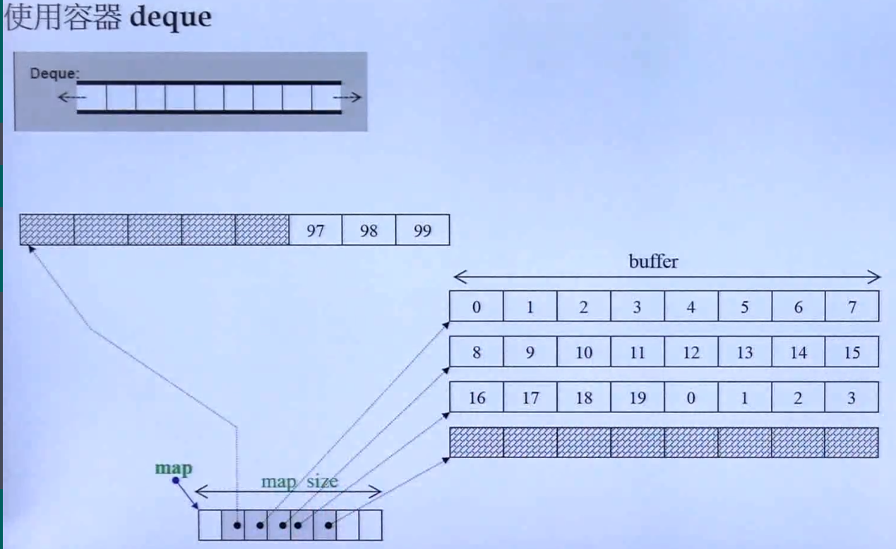
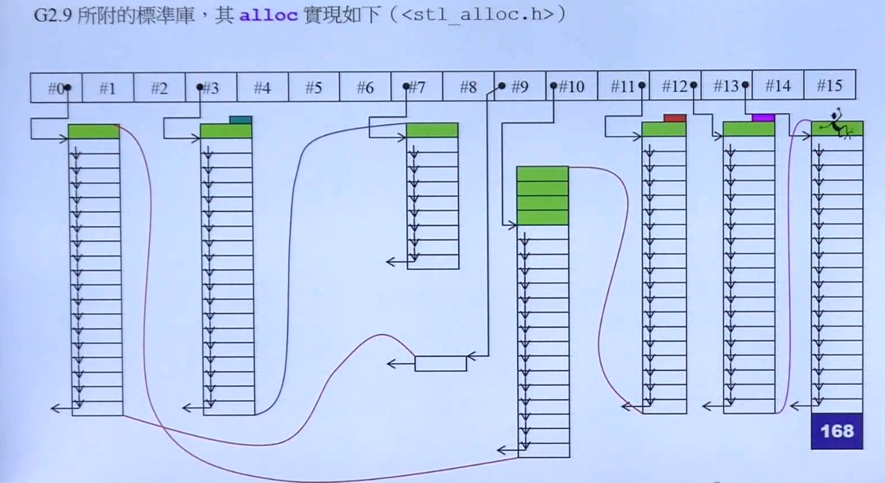
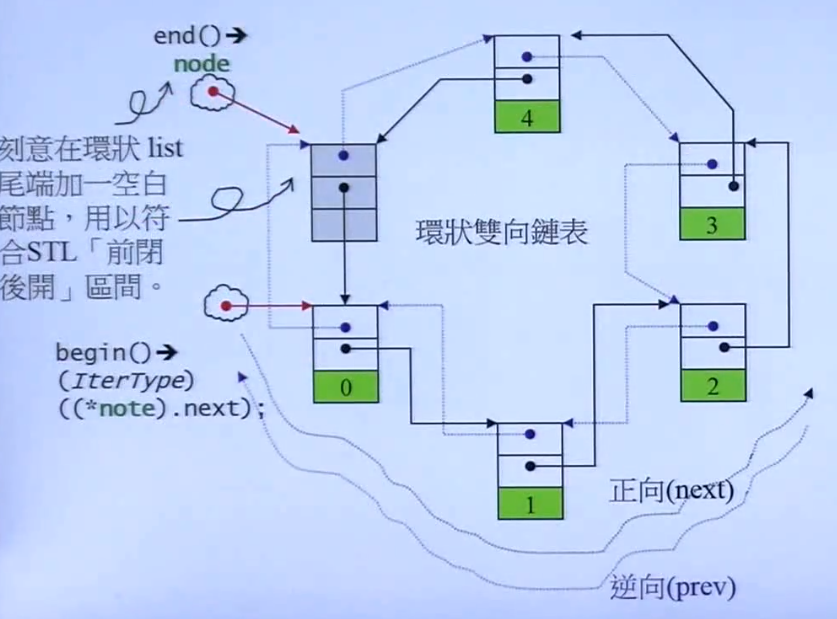
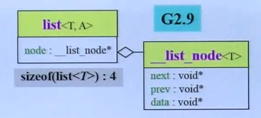
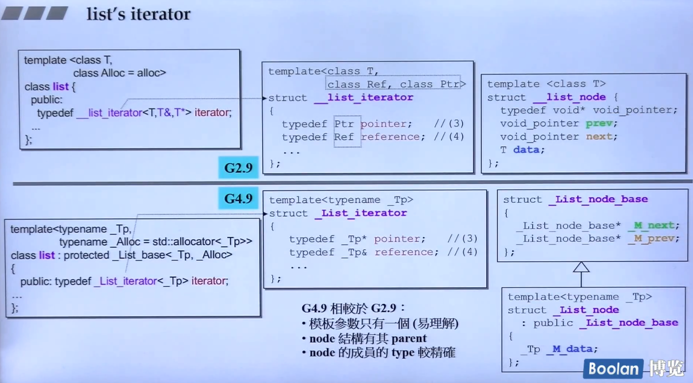
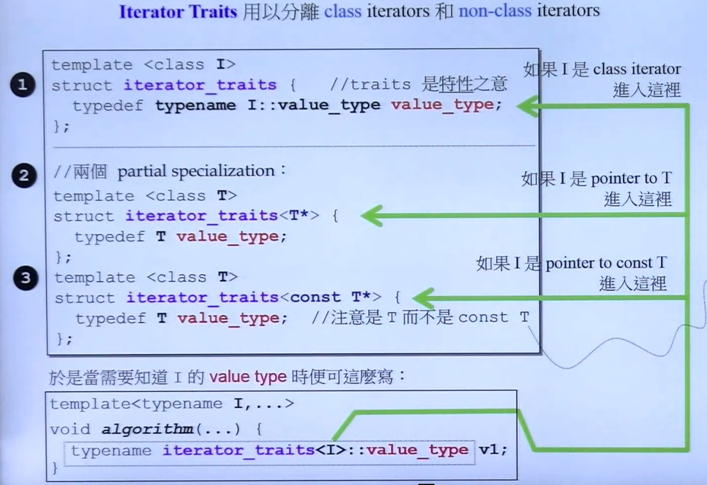
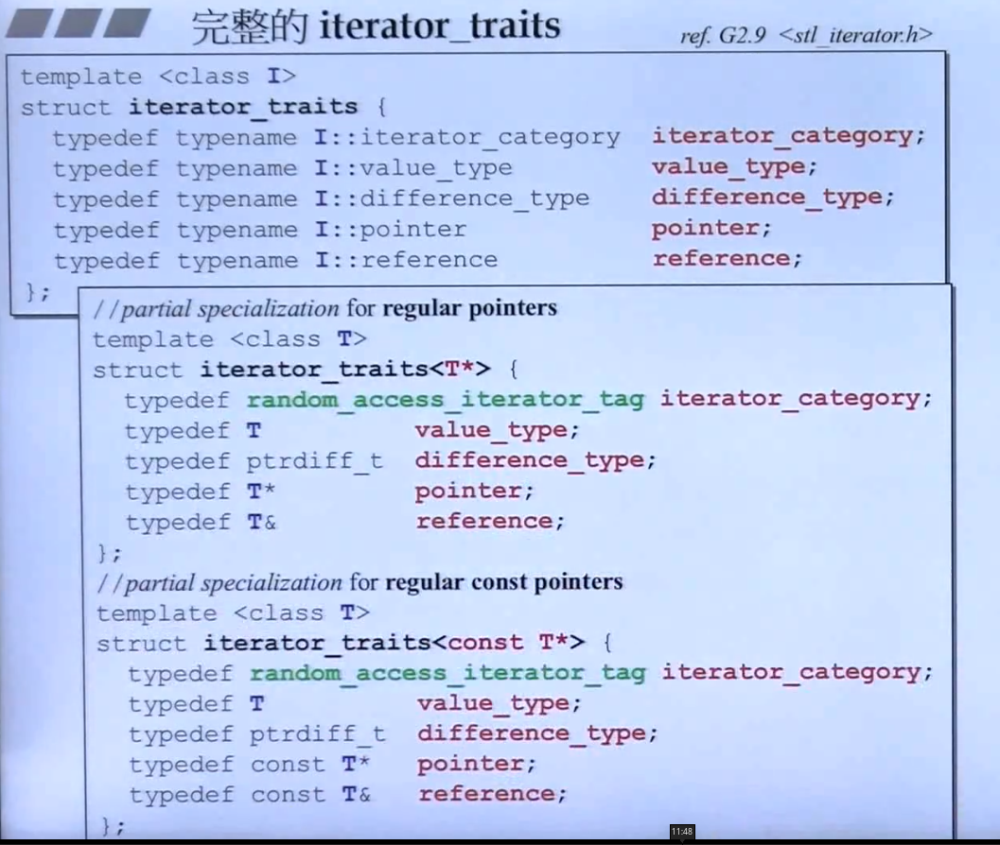

# C++STL体系结构与内核分析
C++标准库 > STL

> 先感受一下

``` c++
#include <iostream>
#include <vector>
#include <functional>
#include <algorithm>

using namespace std;

int main(int argc, char *argv[]) {

  int ia[6] = {27, 210, 12, 47, 109, 83};
  vector<int, allocator<int>> vi(ia, ia+6);

  cout << count_if(vi.begin(), vi.end(), not1(bind2nd(less<int>(), 40)));

  return 0;
}

```


## 容器使用
- Array
- Vector
- Dqueue
- List
- Forward-List

- Set/Multiset
- Map/Multimap

### 各种测试

工具函数

``` c++
namespace util{
  long get_a_target_long() {
    long target = 0;
    cout << "target (0~" << RAND_MAX << "): ";
    cin >> target;
    return target;
  }

  string get_a_target_string() {
    long target = 0;
    char buf[10];

    cout << "target (0~" << RAND_MAX << "): ";
    cin >> target;
    snprintf(buf, 10, "%ld", target);
    return string(buf);
  }

  int compareLongs(const void* a, const void* b) {
    return (*(long*)a - *(long*)b);
  }

  int compareStrings(const void* a,const void* b) {
    if (*(string*)a > *(string*)b) {
      return 1;
    } else if (*(string*)a < *(string*)b) {
      return -1;
    } else {
      return 0;
    }
  }
}


```

> 非关联性容器

- Array

``` c++
#include <array>
#include <cstdlib>
#include <ctime>
#include <string>
#include <iostream>
#include <vector>
#include <functional>
#include <algorithm>

using namespace std;

const long ASIZE = 10000 *50;

namespace array_test {
  void test_array() {
    cout << "test_array()...........\n";
    array<long, ASIZE> c;

    clock_t timeStart = clock();
    for (long i = 0;i < ASIZE;i++) {
      c[i] = rand();
    }
    cout << "milli-seconds: " << (clock() - timeStart) << endl;
    cout << "array.size(): " << c.size() << endl;
    cout << "array.front(): " << c.front() << endl;
    cout << "array.back(): " << c.back() << endl;
    cout << "array.data(): "  << c.data() << endl;

    long target = util::get_a_target_long();
    timeStart = clock();
    qsort(c.data(), ASIZE, sizeof(long), util::compareLongs);
    long* pItem = (long*)bsearch(&target, (c.data()), ASIZE, sizeof(long), util::compareLongs);

    cout << "qsort() + bsearch(), milli-seconds : " << (clock() - timeStart) << endl;

    if (pItem != nullptr) {
      cout << "found, " << *pItem << endl;
    } else {
      cout << "not found!" << endl;
    }
  }
}

int main(int argc, char *argv[]) {

  array_test::test_array();
  return 0;
}

```

- Vector

``` c++

namespace vector_test {
  void test_vector() {
    long value;
    cout << "test_vector()...\n";
    cin >> value;
    vector<string> c;
    char buf[10];

    clock_t timeStart = clock();
    for (long i = 0;i < value;++i) {
      try {
        snprintf(buf, 10, "%d", rand());
        c.push_back(string(buf));
      } catch (exception& p) {
        cout << "i=" << i << " "<< p.what() << endl;
        abort();
      }
    }
    cout << "mill-seconds: " << (clock() - timeStart) << endl;
    cout << "vector.size(): " << c.size() << endl;
    cout << "vector.front(): " << c.front() << endl;
    cout << "vector.back(): " << c.back() << endl;
    cout << "vector.data(): " << c.data() << endl;
    cout << "vector.capacity(): " << c.capacity() << endl;

    string target = util::get_a_target_string();
    {
      timeStart = clock();

      vector<string>::iterator pItem = ::find(c.begin(), c.end(), target);
      cout << "::find(), mill-seconds: " << (clock() - timeStart) << endl;

      if (pItem != c.end()) {
        cout << "found, " << *pItem << endl;
      } else {
        cout << "not found" << endl;
      }
    }

    {
      timeStart = clock();
      sort(c.begin(), c.end());
      string *pItem = (string *)bsearch(&target, (c.data()), c.size(),
                                        sizeof(string), util::compareStrings);
      cout << "sort-bsearch(), mill-seconds: " << (clock() - timeStart) << endl;
      if (pItem != nullptr) {
        cout << "found, " << *pItem << endl;
      } else {
        cout << "not found" << endl;
      }
    }
  }
}

int main(int argc, char *argv[]) {

  vector_test::test_vector();
  return 0;
}

```

- list

``` c++

#include <list>
namespace list_test {
void test_list() {
  cout << "test_list()...\n";
  list<string> c;
  char buf[10];

  clock_t timeStart = clock();
  for (long i = 0; i < ASIZE; ++i) {
    try {
      snprintf(buf, 10, "%d", rand());
      c.push_back(string(buf));
    } catch (exception &p) {
      cout << "i=" << i << " " << p.what() << endl;
      abort();
    }
  }
  cout << "mill-seconds: " << (clock() - timeStart) << endl;
  cout << "list.size(): " << c.size() << endl;
  cout << "list.max_size(): " << c.max_size() << endl;
  cout << "list.front(): " << c.front() << endl;
  cout << "list.back(): " << c.back() << endl;

  string target = util::get_a_target_string();
  {
    timeStart = clock();

    list<string>::iterator pItem = ::find(c.begin(), c.end(), target);
    cout << "::find(), mill-seconds: " << (clock() - timeStart) << endl;

    if (pItem != c.end()) {
      cout << "found, " << *pItem << endl;
    } else {
      cout << "not found" << endl;
    }
  }

  {
    timeStart = clock();
    c.sort();
    cout << "sort-bsearch(), mill-seconds: " << (clock() - timeStart) << endl;
  }
}
} // namespace list_test

```

- forward_list

``` c++
namespace flist_test {
void test_flist() {
  cout << "test_flist()...\n";
  forward_list<string> c;
  char buf[10];

  clock_t timeStart = clock();
  for (long i = 0; i < ASIZE; ++i) {
    try {
      snprintf(buf, 10, "%d", rand());
      c.push_front(string(buf));
    } catch (exception &p) {
      cout << "i=" << i << " " << p.what() << endl;
      abort();
    }
  }
  cout << "mill-seconds: " << (clock() - timeStart) << endl;
  cout << "flist.max_size(): " << c.max_size() << endl;
  cout << "flist.front(): " << c.front() << endl;

  string target = util::get_a_target_string();
  {
    timeStart = clock();

    forward_list<string>::iterator pItem = ::find(c.begin(), c.end(), target);
    cout << "::find(), mill-seconds: " << (clock() - timeStart) << endl;

    if (pItem != c.end()) {
      cout << "found, " << *pItem << endl;
    } else {
      cout << "not found" << endl;
    }
  }

  {
    timeStart = clock();
    c.sort();
    cout << "sort-bsearch(), mill-seconds: " << (clock() - timeStart) << endl;
  }
}
} // namespace flist_test


```

- deque 



``` c++
#include <deque>

namespace deque_test {
void test_deque() {
  cout << "test_deque()...\n";
  deque<string> c;
  char buf[10];

  clock_t timeStart = clock();
  for (long i = 0; i < ASIZE / 2; ++i) {
    try {
      snprintf(buf, 10, "%d", rand());
      c.push_back(string(buf));
    } catch (exception &p) {
      cout << "i=" << i << " " << p.what() << endl;
      abort();
    }
  }
  for (long i = 0; i < ASIZE / 2; ++i) {
    try {
      snprintf(buf, 10, "%d", rand());
      c.push_front(string(buf));
    } catch (exception &p) {
      cout << "i=" << i << " " << p.what() << endl;
      abort();
    }
  }
  cout << "mill-seconds: " << (clock() - timeStart) << endl;
  cout << "deque.size(): " << c.size() << endl;
  cout << "deque.max_size(): " << c.max_size() << endl;
  cout << "deque.front(): " << c.front() << endl;
  cout << "deque.back(): " << c.back() << endl;

  string target = util::get_a_target_string();
  {
    timeStart = clock();

    deque<string>::iterator pItem = ::find(c.begin(), c.end(), target);
    cout << "::find(), mill-seconds: " << (clock() - timeStart) << endl;

    if (pItem != c.end()) {
      cout << "found, " << *pItem << endl;
    } else {
      cout << "not found" << endl;
    }
  }

  {
    timeStart = clock();
    sort(c.begin(), c.end());
    cout << "sort-bsearch(), mill-seconds: " << (clock() - timeStart) << endl;
  }
}
} // namespace deque_test

```

- stack

类似 使用 push 和 pop 进行操作

- queue
 
类似 使用 push 和 pop 进行操作


> 关联性容器

- multiset

``` c++

#include <set>
namespace multiset_test {
void test_multiset() {
  cout << "test_multiset()..... \n";
  multiset<string> c;
  char buf[10];

  clock_t timeStart = clock();
  for (long i = 0; i < ASIZE; i++) {
    try {
      snprintf(buf, 10, "%d", rand());
      c.insert(string(buf));
    } catch (exception &p) {
      cout << "i=" << i << " " << p.what() << endl;
    }
  }

  cout << "mill-seconds: " << (clock() - timeStart) << endl;
  cout << "multiset.size(): " << c.size() << endl;
  cout << "multiset.max_size(): " << c.max_size() << endl;
  string target = util::get_a_target_string();

  {
    timeStart = clock();

    multiset<string>::iterator pItem = ::find(c.begin(), c.end(), target);
    cout << "::find(), mill-seconds: " << (clock() - timeStart) << endl;

    if (pItem != c.end()) {
      cout << "found, " << *pItem << endl;
    } else {
      cout << "not found" << endl;
    }
  }

  {
    timeStart = clock();
    c.find(target);
    cout << "c.find(), mill-seconds: " << (clock() - timeStart) << endl;
  }
}

} // namespace multiset_test


```

- multimap 

``` c++
#include <map>
namespace multimap_test {
void test_multimap() {
  cout << "test_multiset()..... \n";
  multimap<long, string> c;
  char buf[10];

  clock_t timeStart = clock();
  for (long i = 0; i < ASIZE; i++) {
    try {
      snprintf(buf, 10, "%d", rand());
      c.insert(pair<long, string>(i, buf));
    } catch (exception &p) {
      cout << "i=" << i << " " << p.what() << endl;
    }
  }

  cout << "mill-seconds: " << (clock() - timeStart) << endl;
  cout << "multimap.size(): " << c.size() << endl;
  cout << "multimap.max_size(): " << c.max_size() << endl;
  long target = util::get_a_target_long();

  {
    timeStart = clock();
    c.find(target);
    cout << "c.find(), mill-seconds: " << (clock() - timeStart) << endl;
  }
}
} // namespace multimap_test


```

- unordered_mutilset (拉链法实现的一个hash table)

``` c++
#include <unordered_set>
namespace unordered_multiset_test {
void test_unoredered_multiset() {
  cout << "test_unoredered_multiset().....\n";
  unordered_multiset<string> c;
  char buf[10];

  clock_t timeStart = clock();
  for (long i = 0; i < ASIZE; i++) {
    try {
      snprintf(buf, 10, "%d", rand());
      c.insert(string(buf));
    } catch (exception &p) {
      cout << "i=" << i << " " << p.what() << endl;
    }
  }

  cout << "mill-seconds: " << (clock() - timeStart) << endl;
  cout << "unordered_multiset.size(): " << c.size() << endl;
  cout << "unordered_multiset.max_size(): " << c.max_size() << endl;
  cout << "unordered_multiset.bucket_count(): " << c.bucket_count() << endl;
  cout << "unordered_multiset.load_factor(): " << c.load_factor() << endl;
  cout << "unordered_multiset.max_load_factor(): " << c.max_load_factor()
       << endl;
  cout << "unordered_multiset.max_bucket_count(): " << c.max_bucket_count()
       << endl;

  for (unsigned i = 0; i < 20; i++) {
    cout << "B[" << i << "] hash " << c.bucket_size(i) << " elems\n";
  }
  string target = util::get_a_target_string();
  {
    timeStart = clock();

    auto pItem = ::find(c.begin(), c.end(), target);
    cout << "::find(), mill-seconds: " << (clock() - timeStart) << endl;

    if (pItem != c.end()) {
      cout << "found, " << *pItem << endl;
    } else {
      cout << "not found" << endl;
    }
  }

  {
    timeStart = clock();
    c.find(target);
    cout << "c.find(), mill-seconds: " << (clock() - timeStart) << endl;
  }
}
} // namespace unordered_multiset_test


```


- unordered_mutilmap (拉链法实现的一个hash table)

``` c++
#include <unordered_map>
namespace unordered_multimap_test {
void test_unoredered_multimap() {
  cout << "test_unoredered_multimap().......\n";
  unordered_multimap<long, string> c;
  char buf[10];

  clock_t timeStart = clock();
  for (long i = 0; i < ASIZE; i++) {
    try {
      snprintf(buf, 10, "%d", rand());
      c.insert(pair<long, string>(i, buf));
    } catch (exception &p) {
      cout << "i=" << i << " " << p.what() << endl;
    }
  }

  cout << "mill-seconds: " << (clock() - timeStart) << endl;
  cout << "unordered_multiset.size(): " << c.size() << endl;
  cout << "unordered_multiset.max_size(): " << c.max_size() << endl;
  cout << "unordered_multiset.bucket_count(): " << c.bucket_count() << endl;
  cout << "unordered_multiset.load_factor(): " << c.load_factor() << endl;
  cout << "unordered_multiset.max_load_factor(): " << c.max_load_factor()
       << endl;
  cout << "unordered_multiset.max_bucket_count(): " << c.max_bucket_count()
       << endl;

  for (unsigned i = 0; i < 20; i++) {
    cout << "B[" << i << "] hash " << c.bucket_size(i) << " elems\n";
  }
  long target = util::get_a_target_long();
  {
    timeStart = clock();
    c.find(target);
    cout << "c.find(), mill-seconds: " << (clock() - timeStart) << endl;
  }
}
} // namespace unordered_multimap_test


```


## 分配器

> 先谈谈operator new() 和 malloc()

operator new() 会调用 malloc() 然后根据操作系统返回内存

> STL(vc6) 对allocator的使用

``` c++
template<class _Ty, class _A = allocator<_Ty> > class vector {
  ...
};

template<class _Ty, class _A = allocator<_Ty> > class list {
  ...
};

template<class _Ty, class _A = allocator<_Ty> > class deque {
  ...
};
```

> gcc2.91 的alloc (具体应该会在内存管理章节讲解)

``` c++
template <class _Tp>
class allocator {
  typedef alloc _Alloc;          // The underlying allocator.
public:
  typedef size_t     size_type;
  typedef ptrdiff_t  difference_type;
  typedef _Tp*       pointer;
  typedef const _Tp* const_pointer;
  typedef _Tp&       reference;
  typedef const _Tp& const_reference;
  typedef _Tp        value_type;

  template <class _Tp1> struct rebind {
    typedef allocator<_Tp1> other;
  };

  allocator() __STL_NOTHROW {}
  allocator(const allocator&) __STL_NOTHROW {}
  template <class _Tp1> allocator(const allocator<_Tp1>&) __STL_NOTHROW {}
  ~allocator() __STL_NOTHROW {}

  pointer address(reference __x) const { return &__x; }
  const_pointer address(const_reference __x) const { return &__x; }

  // __n is permitted to be 0.  The C++ standard says nothing about what
  // the return value is when __n == 0.
  _Tp* allocate(size_type __n, const void* = 0) {
    return __n != 0 ? static_cast<_Tp*>(_Alloc::allocate(__n * sizeof(_Tp)))
                    : 0;
  }

  // __p is not permitted to be a null pointer.
  void deallocate(pointer __p, size_type __n)
    { _Alloc::deallocate(__p, __n * sizeof(_Tp)); }

  size_type max_size() const __STL_NOTHROW
    { return size_t(-1) / sizeof(_Tp); }

  void construct(pointer __p, const _Tp& __val) { new(__p) _Tp(__val); }
  void destroy(pointer __p) { __p->~_Tp(); }
};

```




> 使用方法
```
vector<string, __gun_cxx::__poll_alloc<string>> vc;
```

## 容器剖析

> 序列式容器

- array(since C++ 11)
- vector
  - heap(以算法形式呈现)
  - priority_queue
- list(单向)
- slist(单向 非标准)
- deque(分段连续空间)
  - stack(container adapter)
  - queue(container adapter)

> 关联式容器
- rv_tree(非公开)
  - set
  - map
  - multiset
  - multimap
- hashtable(非公开) 
  - hash_set
  - hash_map
  - hash_multiset
  - hash_multimap

### list





``` c++
#include <ext/pool_allocator.h>

template <class T>
struct __list_node {
  typedef void* void_pointer;
  void_pointer prev;
  void_pointer next;
  T data;
};

template <class T, class Ref, class Ptr>
struct __list_iterator {

  typedef __list_iterator<T, Ref, Ptr> self;
  // TODO
  typedef T value_type;
  typedef Ptr pointer;
  typedef Ref reference;

  typedef __list_node<T>* link_type;
  // TODO
  link_type node;

  reference operator*() const { return (*node).data; }
  pointer operator->() const { return &(operator*()); }
  // self& 和 self的区别是为了处理 ++++i i++++(这种c++不支持)
  // ++i
  self& operator++() {
    node = (link_type)((*node).next);
    return *this;
  }
  // i++
  self operator++(int) {
    self tmp = *this;
    ++*this;
    return tmp;
  }
};

template <class T, class Alloc = __gnu_cxx::__pool_alloc<T>> class list {
  protected:
    typedef __list_node<T> list_node;
  public:
    typedef list_node* link_type;
    typedef __list_iterator<T, T&, T*> iterator;
  protected:
    link_type node; // 8bytes
};

```



### vector

``` c++
#include <exception>
#include <ext/pool_allocator.h>

template <class T, class Alloc = __gnu_cxx::__pool_alloc<T>> class vector {
public:
  typedef T value_type;
  typedef value_type *iterator; // T*
  typedef value_type &reference;
  typedef size_t size_type;

protected:
  iterator start;
  iterator finish;
  iterator end_of_storage;

public:
  iterator begin() { return start; }
  iterator end() { return finish; }
  size_type size() const { return size_type(end() - begin()); }
  size_type capacity() const { return size_type(end_of_storage() - begin()); }
  bool empty() const { return begin() == end(); }
  reference operator[](size_type n) { return *(begin() + n); }
  reference front() { return *begin(); }
  reference back() { return *(end() - 1); }

  void push_back(const value_type& x);

private:
  void insert_aux(iterator, const value_type&);
};

template<class T, class Alloc>
void vector<T,Alloc>::push_back(const T& x) {
  if (finish != end_of_storage) { // 还有备用空间
    construct(finish, x); // 全局函数
    ++finish; // 调整水位
  } else { // 没有备用空间
    insert_aux(end(), x);
  }
}

template <class T, class Alloc>
void vector<T, Alloc>::insert_aux(vector<T, Alloc>::iterator position, const T& x) {
  if (finish != end_of_storage) {
    // 在备用空间起始处构建一个元素 并以vector最后一个元素作为其初值
    construct(finish, *(finish-1)); // 全局函数
    ++finish; // 调整水位
    T x_copy = x;
    copy_backward(position, finish - 2, finish - 1);
    *position  = x_copy;
  } else { // 没有备用空间
    const size_type old_size = size();
    const size_type len = old_size != 0 ? 2 * old_size : 1; // 扩展二倍
    iterator new_start = data_allocator::alocate(len);
    iterator new_finish = new_start;
    try {
      // 将原有的cevtor的内容拷贝到新的vector
      new_finish = uninitialized_copy(start, position, new_start);
      construct(new_finish, x); // 为新元素
      ++new_finish;
      // 拷贝插入点后的原本内容 这是给 insert 用的
      new_finish = uninitialized_copy(position, finish, new_finish);
    } catch(std::exception& e) {
      destroy(new_start, new_finish);
      data_allocator::dealocate(new_start, len);
      throw;
    }
    // 析构并释放原vector
    destroy(begin(), end());
    deallocate();
    // 调整迭代器 指向新的vector
    start = new_start;
    finish = new_finish;
    end_of_storage = new_start + len;
  }
}

```

### array

看一下 TR1 的实现

``` c++
template<typename _Tp, std::size_t _Nm>
struct array {
  typedef  _Tp value_type;
  typedef _Tp pointer;
  typedef value_type* iterator;

  value_type _M_instance[_Nm ? _Nm : 1];

  iterator begin() {
    return  iterator(&_M_instance[0]);
  }
  iterator end() {
    return  iterator(&_M_instance[_Nm]);
  }
};

```


### deque


### queue


### stack


## 算法


## 迭代器
前闭后开 `[ )`

``` c++
Container<T> c;
...
Container<T> it = c.begin();
for (; it != c.end();++it){
    // 
}
```

``` c++
std::vector<double> vec;
...
for (auto elem : vec) {
  std::cout << elem << std::endl;
}

...
for (auto& elem : vec) {
  elem *= 3;
}
```

### Iterator需要遵循的原则


迭代器将一段容器的范围传给算法，并通过iterator来操作元素，这时需要一些iterator的性质来优化其操作。

``` c++
#include <iterator>

template<typename _Iter>
inline typename std::iterator_traits<_Iter>::iterator_category
__tierator_category(const _Iter&)
{
  return typename std::iterator_traits<_Iter>::iterator_category();
} // 返回分类 [1]

template<typename _RandonAccessIterator>
void __rotate(
  _RandonAccessIterator __first,
  _RandonAccessIterator __middle,
  _RandonAccessIterator __last,
  std::random_access_iterator_tag) // 见[1]
{
  typedef typename std::iterator_traits<_RandonAccessIterator>::difference_type _Distance; // it的距离
  typedef typename std::iterator_traits<_RandonAccessIterator>::value_type _valueType; // it的值类型
  // ...
}

template<typename _ForwardIterator>
inline void
rotate(_ForwardIterator __first,
       _ForwardIterator __middle,
       _ForwardIterator __last)
{
  __rotate(__first, __middle, __last , std::__iterator_category(__first));
}

```

Iterator Traits 用来分离calss iterator 和 non-class iterator

``` c++
template <class I> // 如果I是class iterator
struct iterator_traits {
  typedef typename I::value_type value_type;
};

// 两个偏特化
template <class T> // 如果I是pointer to T
struct iterator_traits<T*> {
  typedef T value_type;
};

template <class > // 如果I是pointer to const T
struct iterator_traits<const T*> {
  typedef T value_type;
};
```





## 适配器


## 仿函数


