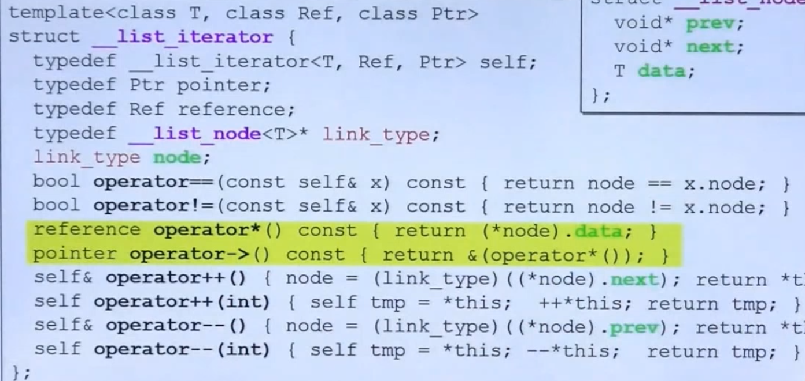
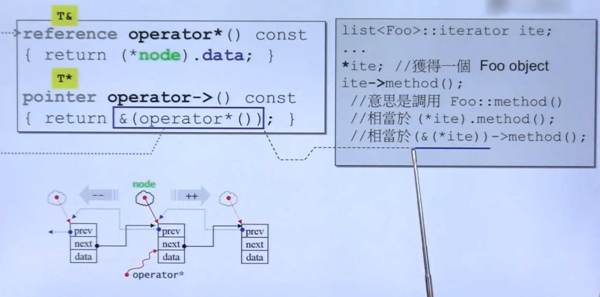
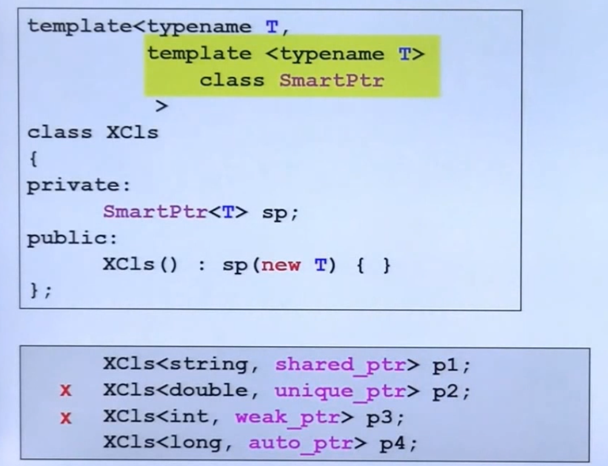
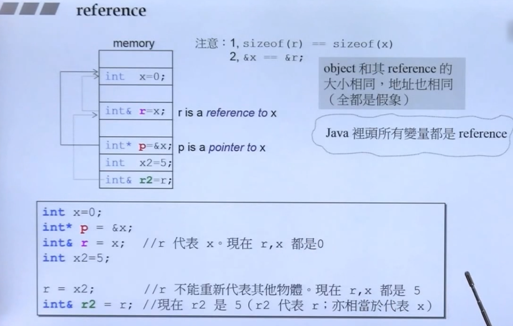
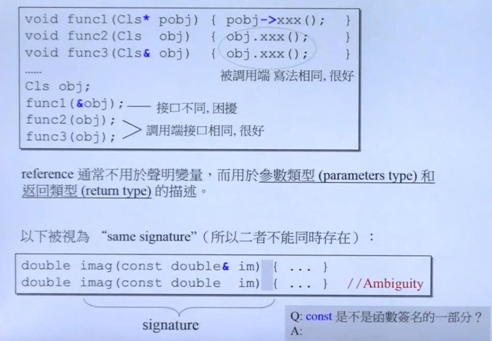
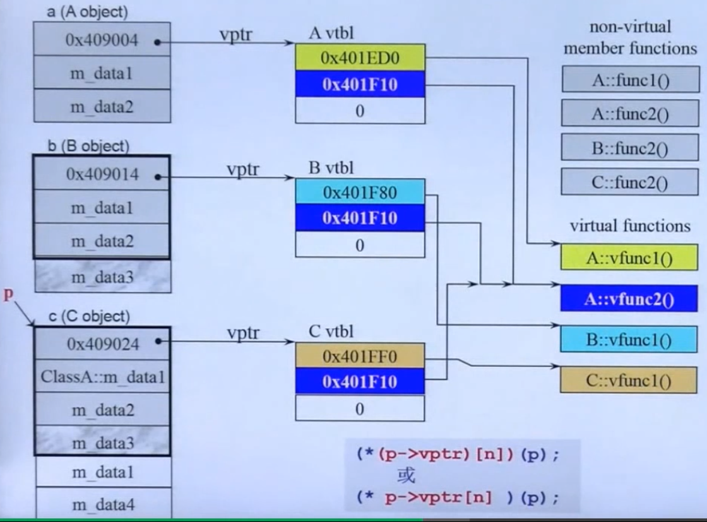
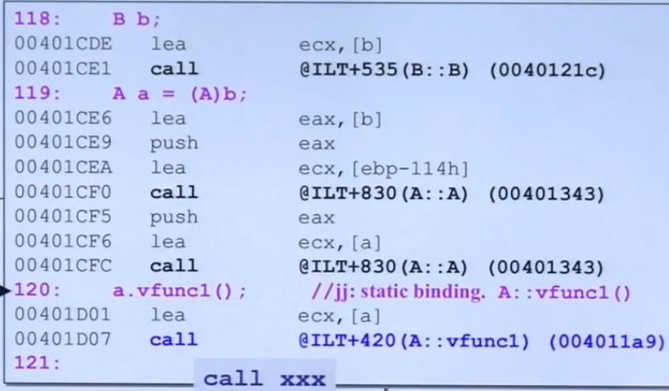
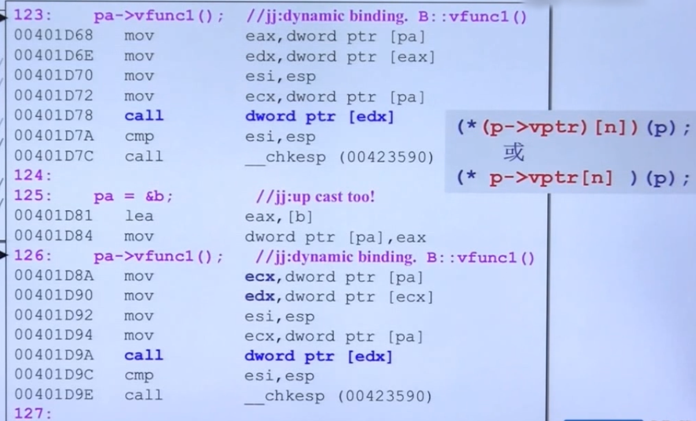

# C++程序设计兼谈对象模型设计

## 转换函数

``` c++
#include <iostream>

class Fraction
{
public:
  Fraction(int num, int den = 1) : m_numerator(num), m_denominator(den) {}
  operator double() const {
    return ((double)m_numerator/m_denominator);
  }
private:
  int m_numerator;   // 分子
  int m_denominator; // 分母
};

int main() {
  Fraction f(3, 5);
  double d = 4+f;
  std::cout << d << std::endl;
}

```

## non-explicit-one-argument 构造函数

将其他类型自动转为当前类型

``` c++
#include <iostream>

class Fraction
{
public:
  Fraction(int num, int den = 1) : m_numerator(num), m_denominator(den) {}
  //operator double() const {
  //  return ((double)m_numerator/m_denominator);
  //}
  Fraction operator +(const Fraction& f) const {
    return ((double)m_numerator/m_denominator);
  }
private:
  int m_numerator;   // 分子
  int m_denominator; // 分母
};

int main() {
  Fraction f(3, 5);
  Fraction d = f+4;
}

```

如果加上

``` c++
#include <iostream>

class Fraction
{
public:
  explicit Fraction(int num, int den = 1) : m_numerator(num), m_denominator(den) {}
  Fraction operator +(const Fraction& f) const {
    return ((double)m_numerator/m_denominator);
  }
private:
  int m_numerator;   // 分子
  int m_denominator; // 分母
};

int main() {
  Fraction f(3, 5);
  Fraction d = f+4;
}

```

会报错

``` c++
non-expllicit.cpp: 在成员函数‘Fraction Fraction::operator+(const Fraction&) const’中:
non-expllicit.cpp:8:32: 错误：could not convert ‘((double)(int)((const Fraction*)this)->Fraction::m_numerator / (double)(int)((const Fraction*)this)->Fraction::m_denominator)’ from ‘double’ to ‘Fraction’
    8 |     return ((double)m_numerator/m_denominator);
      |            ~~~~~~~~~~~~~~~~~~~~^~~~~~~~~~~~~~~
      |                                |
      |                                double

```


## pointer-like classes

### 智能指针
``` c++
template<calass T>
class shared_ptr
{
public:
  T& operator*() const {
    return *px;
  }
  T* operator->() const {
    return px;
  }
  share_ptr(T* p) : px(p) {}
  
private:
  T*    px;
  long* pn;
}
```

### 迭代器




``` c++
reference operator*() const {
  return (*node).data;
}

pointer operator->() const {
  return &(operator*());
}
```

## function-like classes
重载`()`


## namespace

``` c++
#include <iostream>

namespace fraction {
  class Fraction {
  public:
    Fraction(int num, int den = 1) : m_numerator(num), m_denominator(den) {}
    operator double() const { return ((double)m_numerator / m_denominator); }

  private:
    int m_numerator;   // 分子
    int m_denominator; // 分母
  };
}

int main(int argc, char *argv[]) {

  fraction::Fraction f(3, 5);
  double d = 4+f;
  std::cout << d << std::endl;

  return 0;
}

```

## 成员模板

``` c++
namespace pair_tmpl {
  template<class T1, class T2>
  struct pair{
    typedef T1 first_type;
    typedef T2 second_type;

    T1 first;
    T2 second;

    pair() : first(T1()), second(T2()) {}
    pair(const T1& a, const T2& b) : first(a), second(b) {}

    // 成员模板
    template <class U1, class U2>
    pair(const pair<U1, U2>& p)
      : first(p.first), second(p.second) {}
  };

  class Base1 {};
  class Sub1 : public Base1 {};

  class Base2 {};
  class Sub2 : public Base2 {};
}

int main(int argc, char *argv[]) {

  pair_tmpl::pair<pair_tmpl::Sub1, pair_tmpl::Sub2> p;
  pair_tmpl::pair<pair_tmpl::Base1, pair_tmpl::Base2> p2(p);

  return 0;
}

```

``` c++
template<typename _Tp>
class shared_ptr : public __shared_ptr<_TP>
{
...
  template<typename _Tp1>
  explicit shared_ptr(_Tp1* __p): __shared_ptr<_Tp>(__p) {}
...
}

Base1 * ptr = new Sub1;

shared_ptr<Base1> sptr(new Sub1);
```

## specialization 模板特化

其实 模板其实就是泛化

在泛化的基础上，根据不同的类型做出不同的处理
``` c++
namespace specialization {
template <class Key> struct hash {};

template <> struct hash<char> {
  std::size_t operator()(char x) const { return x; }
};

template <> struct hash<int> {
  std::size_t operator()(char x) const { return x; }
};

template <> struct hash<long> {
  std::size_t operator()(char x) const { return x; }
};

} // namespace specialization


```

### 模板偏特化
- 个数的偏特化

``` c++
template<typename T, typename Alloc=...>
class vector
{
  ...
};

template<typename Alloc=...>
class vector<bool, Alloc>
{
  ...
};
```

- 范围的偏特化

``` c++

template <typename T> class C {};

template <typename T> class C<T *> {};

C<string> obj1;
C<string*> obj2;
```


## 模板模板参数




``` c++
template <typename T, template <typename> class SmartPtr> class XCls {
private:
  SmartPtr<T> sp;

public:
  XCls() : sp(new T) {}
};

```

### 三个主题

### 数量不定的模板参数
``` c++
namespace variadic {
  void print() {} // 最后调用到没参数的时候要做的事情

  template <typename T, typename... Types>
  void print(const T& firstArg, const Types&... args) {
    std::cout << firstArg << std::endl;
    print(args...);
  }
}
```

- sizeof...(args)

``` c++
namespace variadic {
  void print() {}

  template <typename T, typename... Types>
  void print(const T& firstArg, const Types&... args) {
    printf("%d\n", sizeof...(args));
    std::cout << firstArg << std::endl;
    print(args...);
  }
}

```

### auto

``` c++
list<string> c;
...
list<string>::iterator ite;
ite = find(c.begin(), c.end(), target);

auto ite = find(c.begin(), c.end()m target);

```


### ranged-base for

``` c++
for (int i : {2, 3, 4, 5, 6, 7, 8, 9}) {
  cout << i << endl;
}

vector<double> vec;

for (auto elem : vec) {
  cout << elem << endl;
}

for (auto& elem : vec) {
  elem *= 3;
}
```

## Reference(重要)




``` c++
namespace reference {
  typedef struct Stag {int a, b, c, d;} S;
}

int main(int argc, char *argv[]) {

  double x = 0;
  double* p = &x;
  double& r = x;

  std::cout << sizeof(x) << std::endl;
  std::cout << sizeof(p) << std::endl;
  std::cout << sizeof(r) << std::endl;

  std::cout << x << std::endl;
  std::cout << &x << std::endl;
  std::cout << p << std::endl;
  std::cout << *p << std::endl;
  std::cout << &p << std::endl;
  std::cout << r << std::endl;
  std::cout << &r << std::endl;

  reference::S s;
  reference::S& rs = s;

  std::cout << sizeof(s) << std::endl;
  std::cout << sizeof(rs) << std::endl;
  std::cout << &s << std::endl;
  std::cout << &rs << std::endl;

  return 0;
}

```

``` bash
8
8
8

0
0x7fffd7f79b10
0x7fffd7f79b10
0
0x7fffd7f79b08
0
0x7fffd7f79b10

16
16

0x7fffd7f79af8
0x7fffd7f79af8

```


有句话讲得好，reference就是一种漂亮的pointer
#### 引用的用途


- 注意`const`是函数签名的一部分

## 组合 & 继承 & 委托 中的构造和析构

> 组合

- 构造由内而外

``` c++
Container::Container() : Component() {}
```

- 析构由外而内
``` c++
Container::~Container() { ~Component(); }
```

注意，编译器只能帮我们调用default构造器，有需要的话需要自己实现

> 继承


> 继承+组合关系下的构造和析构

- 构造由内而外
子类的构造函数先调用父类的默认构造函数，然后调用组件的默认构造函数，最后才执行自己。

``` c++
Sub::Sub() : Base(), Component() {}
```

- 析构由外而内
子类的析构函数先析构自己，在调用组件的析构函数，最后调用父类的构造函数。

``` bash
Sub::~Sub() { 
  // Do something;
  ~Component();
  ~Base();
}
```

## 关于 vptr 和 vtbl

``` c++
namespace Virtual {
  class A{
  public:
    virtual void vfunc1();
    virtual void vfunc2();
    void func1();
    void func2();

  private:
    int m_data1, m_data2;
  };

  class B : public A{
  public:
    virtual void vfunc1();
    void func2();

  private:
    int m_data3;
  };

  class C : public B{
  public:
    virtual void vfunc1();
    void func2();
  private:
    int m_data_4;
  };
}

```




``` c++
(*(p->vptr)[n])(p)

(* p->vptr[n])(p)
```

### 静态绑定

``` c++
call ox.....
```

### 动态绑定

1. 指针调用 
2. 向上转型
3. 调用的是虚函数

``` c++

(*(p->vptr)[n])(p)

```

## 关于this
**`this` 就是当前对象的地址**

看一个例子 这个和上面的虚机制是一脉相承的
``` c++
class CDocument {
public:
  virtual Serialize();
};

// 一个应用程序框架
CDocument::OnFileOpen() {
  ...
  Serialize(); // 一个虚函数
  ...
}

// 应用程序
class CMyDoc: public CDocument {
  virtual Serialize() {
    ...
  }
}

int main() {
  CMyDoc myDoc;
  ...
  myDoc.OnFileOpen(); // 调用父类方法
  // 相当于 CDocument::OnFileOpen(&myDoc); this == &myDoc
  // 由于是继承所以在子类中其实有一个父类(调用了构造函数) 
  // CDocument::OnFileOpen(&myDoc) 中 传入的指针是一个向上转型的父类(子->父)
  // 然后执行到Serialize() 时由于是一个成员函数相当于 this->Serialize() == &myDoc->Serialize()
  // 然后相当于 (*(this->vptr)[n])(this) 这个就是动态绑定
  
}


```


## 关于动态绑定(看看汇编)

``` c++
B b;

A a = (A)b;
a.vfunc1(); // 这句是静态绑定
```



``` c++
A* pa = new B;
ps->vfunc1();

pa = &b;
pa->vfunc1();
```



## 谈谈const

||const object(data members 不得变动)|non-const object(data members可以变动|
|:--------------------------------------------:|:-:|:-:|
|const member functions(保证不修改data members)| T | T |
|non-const member functions(不保证不修改data members)| F | T |

**当成员函数的const和non-const版本同时存在，const object只能调用 const 版本 non-const object只能调用 non-const版本**

> std::String中的设计

**当成员函数的const和non-const版本同时存在，const object只能调用 const 版本 non-const object只能调用 non-const版本**

``` c++
class template std::basic_string<...>中有如下两个member functions:

charT operator[] (size_typr pos) const {
  // 不需要考虑写时复制
}

reference operator[] (size_type pos) {
  // 必须要考虑写时复制
}
```

## 关于New Delete

> 没有虚函数

``` c++
#include <iostream>
#include <stddef.h>
#include <stdlib.h>
#include <string>

class Foo {
public:
  int _id;
  long _data;
  std::string _str;

public:
  Foo() : _id(0) {
    std::cout << "调用default ctor.this=" << this << "id=" << _id << std::endl;
  }
  Foo(int i) : _id(i) {
    std::cout << "调用default ctor.this=" << this << "id=" << _id << std::endl;
  }
  //virtual ~Foo() { std::cout << "调用dtor.this=" << this << "id=" << _id << std::endl; }
  ~Foo() { std::cout << "调用dtor.this=" << this << "id=" << _id << std::endl; }

  static void *operator new(size_t size);
  static void operator delete(void *pdead, size_t size);
  static void *operator new[](size_t size);
  static void operator delete[](void *pdead, size_t size);
};

void *Foo::operator new(size_t size) {
  std::cout << "调用new() size=" << size <<std::endl;
  std::cout << "先申请内存\n";
  Foo *p = (Foo *)malloc(size);
  return p;
}

void Foo::operator delete(void *pdead, size_t size) {
  std::cout << "调用delete()\n";
  std::cout << "free内存\n";
  free(pdead);
}

void *Foo::operator new[](size_t size) {
  std::cout << "调用new[]() size=" << size <<std::endl;
  std::cout << "先申请内存\n";
  Foo *p = (Foo *)malloc(size);
  return p;
}

void Foo::operator delete[](void *pdead, size_t size) {
  std::cout << "调用delete[]()\n";
  std::cout << "free内存\n";
  free(pdead);
}

int main(int argc, char *argv[]) {

  std::cout << sizeof(Foo) << std::endl;

  Foo *p = new Foo(7);
  delete p;

  Foo *pArray = new Foo[5];
  delete[] pArray;

  return 0;
}

```

结果

``` bash
48
调用new() size=48
先申请内存
调用default ctor.this=0x55ee164252c0id=7
调用dtor.this=0x55ee164252c0id=7
调用delete()
free内存
调用new[]() size=248
先申请内存
调用default ctor.this=0x55ee16425308id=0
调用default ctor.this=0x55ee16425338id=0
调用default ctor.this=0x55ee16425368id=0
调用default ctor.this=0x55ee16425398id=0
调用default ctor.this=0x55ee164253c8id=0
调用dtor.this=0x55ee164253c8id=0
调用dtor.this=0x55ee16425398id=0
调用dtor.this=0x55ee16425368id=0
调用dtor.this=0x55ee16425338id=0
调用dtor.this=0x55ee16425308id=0
调用delete[]()
free内存

```

> 有虚函数

``` c++

#include <iostream>
#include <stddef.h>
#include <stdlib.h>
#include <string>

class foo {
public:
  int _id;
  long _data;
  std::string _str;

public:
  foo() : _id(0) {
    std::cout << "调用default ctor.this=" << this << "id=" << _id << std::endl;
  }
  foo(int i) : _id(i) {
    std::cout << "调用default ctor.this=" << this << "id=" << _id << std::endl;
  }
  virtual ~foo() { std::cout << "调用dtor.this=" << this << "id=" << _id << std::endl; }
  //~foo() { std::cout << "调用dtor.this=" << this << "id=" << _id << std::endl; }

  static void *operator new(size_t size);
  static void operator delete(void *pdead, size_t size);
  static void *operator new[](size_t size);
  static void operator delete[](void *pdead, size_t size);
};

void *foo::operator new(size_t size) {
  std::cout << "调用new() size=" << size <<std::endl;
  std::cout << "先申请内存\n";
  foo *p = (foo *)malloc(size);
  return p;
}

void foo::operator delete(void *pdead, size_t size) {
  std::cout << "调用delete()\n";
  std::cout << "free内存\n";
  free(pdead);
}

void *foo::operator new[](size_t size) {
  std::cout << "调用new[]() size=" << size <<std::endl;
  std::cout << "先申请内存\n";
  foo *p = (foo *)malloc(size);
  return p;
}

void foo::operator delete[](void *pdead, size_t size) {
  std::cout << "调用delete[]()\n";
  std::cout << "free内存\n";
  free(pdead);
}

int main(int argc, char *argv[]) {

  std::cout << sizeof(foo) << std::endl;

  foo *p = new foo(7);
  delete p;

  foo *parray = new foo[5];
  delete[] parray;

  return 0;
}

```

结果

``` bash
56
调用new() size=56
先申请内存
调用default ctor.this=0x55d683a2f2c0id=7
调用dtor.this=0x55d683a2f2c0id=7
调用delete()
free内存
调用new[]() size=288
先申请内存
调用default ctor.this=0x55d683a2f308id=0
调用default ctor.this=0x55d683a2f340id=0
调用default ctor.this=0x55d683a2f378id=0
调用default ctor.this=0x55d683a2f3b0id=0
调用default ctor.this=0x55d683a2f3e8id=0
调用dtor.this=0x55d683a2f3e8id=0
调用dtor.this=0x55d683a2f3b0id=0
调用dtor.this=0x55d683a2f378id=0
调用dtor.this=0x55d683a2f340id=0
调用dtor.this=0x55d683a2f308id=0
调用delete[]()
free内存

```

