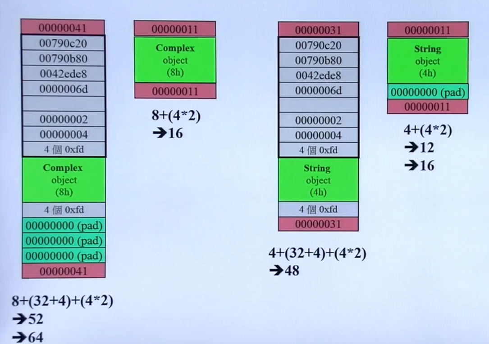
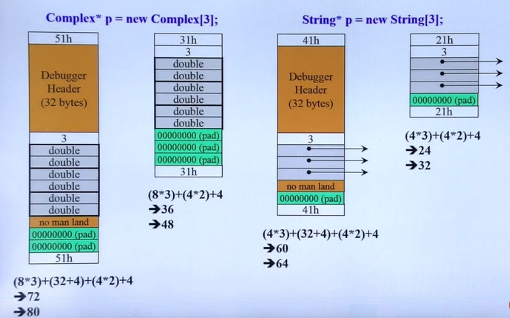
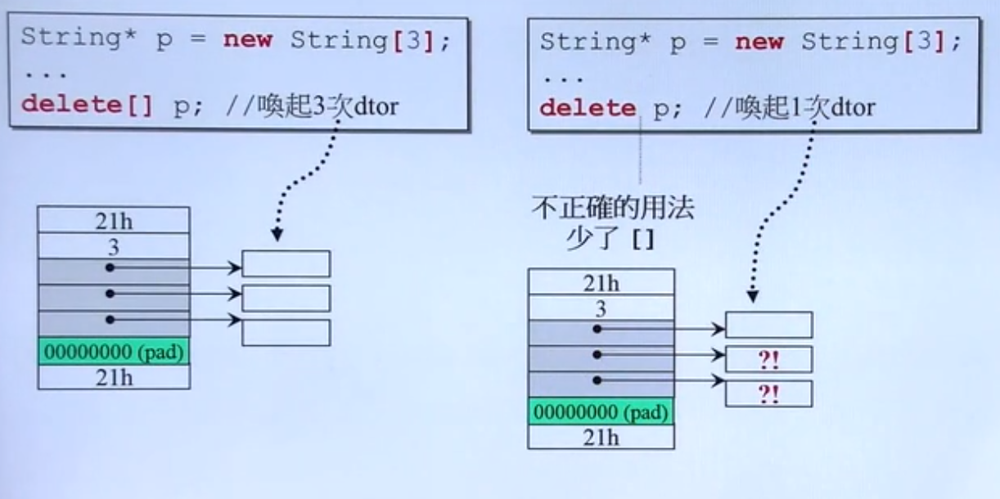
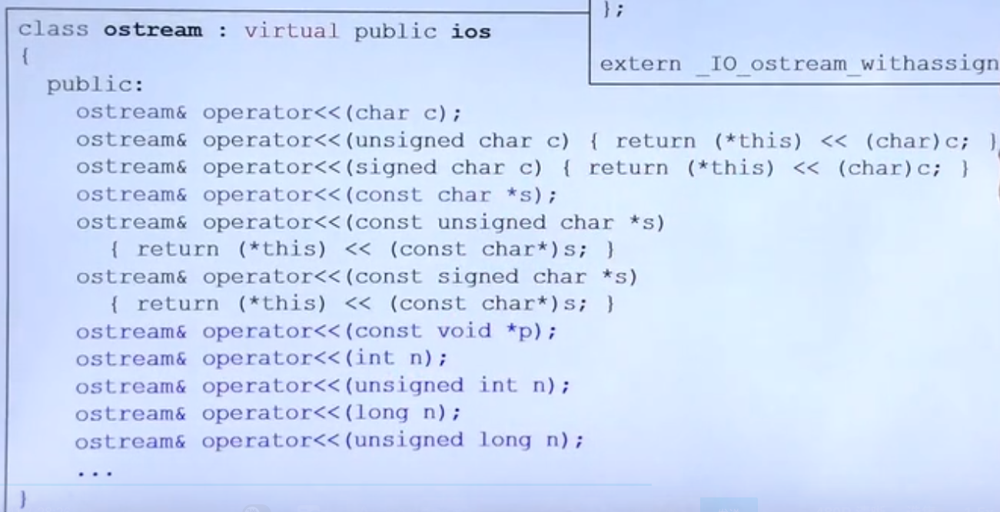
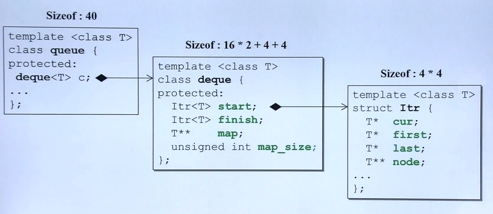
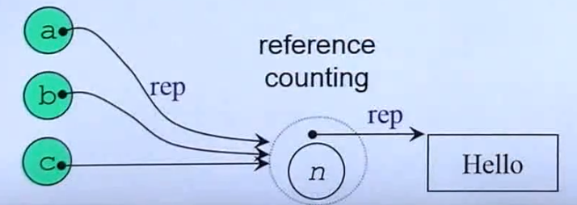
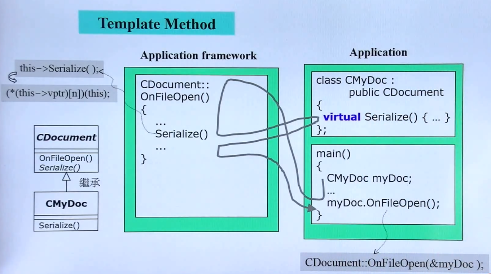
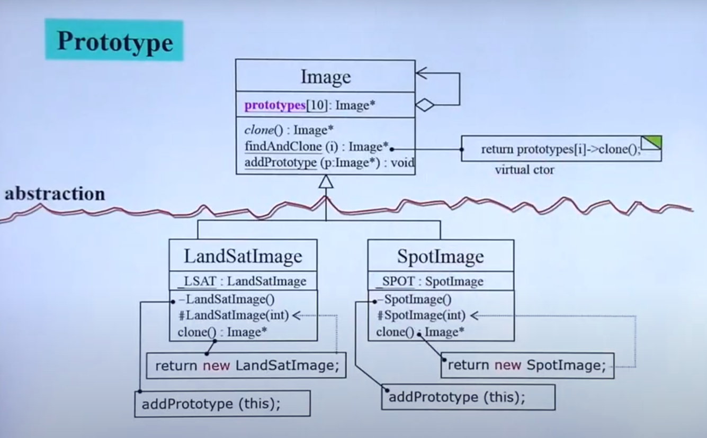

# C++面向对象高级编程

## 概览

``` c++
#ifndef COMPLEX_H_
#define COMPLEX_H_

class complex{
private:
  double re, im;
public:
  complex (double r = 0, double i = 0) : re (r), im (i) {} // 构造函数
  complex& operator += (const complex&); // 函数声明
  double real () const {return re;}
  double imag () const {return im;}

  friend complex& _doap1 (complex*, const complex&);

};

#endif // COMPLEX_H_

```


> 内联函数 (inline)


函数如果在class body中定义完成，那么就会成为incline函数候选者
``` c++

  double real () const {return re;}
```

- inline 只适用于函数体内代码简单的函数，不能包含复杂的结构控制语句，如while、switch，并且内联函数本身不能是递归函数
- inline函数仅仅是对编译器的建议，最后能否真正的内联，决定在编译器。
- inline关键字必须与函数定义体放在一起才能使函数成为内联。仅将inline放在函数声明前，不起任何作用。

**建议：因为上一条的原因，最好将内联函数的定义放在头文件里。**


> 访问级别

- public 部分调用函数 默认 (这是与struct 最大的不同 struct 是public的)
- private 所有的数据 内部使用的函数
- protect 子类可用

> 构造函数

``` c++
  complex (double r = 0, double i = 0)  // 默认实参
  : re (r), im (i)  // initialization list 这种写法更高效 这里是初始化 后面是赋值
  {
  
  } // 构造函数
```


- 与类名相同
- 没有返回值
- 可以有多个(重载)
- **创建对象时自动调用**

``` c++
int main() {
  complex c1(2, 1);
  complex c2;
  complex *p = new complex(4);
}
```

> 析构函数

不带指针的类大部分不需要析构函数

> 将构造函数放到 `private` 区域中

- 单例模式

``` c++
class A {
public:
  static A& getInstance();
 void  setup();

private:
  A();
  A(const A& rhs);
};

  A& A::getInstance() {
  static A a;
  return a;
}

A::getInstance.setup();

```

> const

不改变类内的数据的时候，应该+ const

``` c++
  double real () const {return re;}
  double imag () const {return im;}
```


如果不加 const 的话

``` c++
  double real () {return re;}
  double imag () {return im;}
```

如果使用者这样使用

``` c++
int main() {
  const complex c(2, 1);
  cout << c.reaol();
  cout << c.imag();
}
```

就会这样报错

``` bash
main.cpp: 在函数‘int main(int, char**)’中:
main.cpp:8:18: 错误：passing ‘const complex’ as ‘this’ argument discards qualifiers [$
rg/onlinedocs/gcc/Warning-Options.html#index-fpermissive-fpermissive]
    8 |   cout << c1.real();
      |           ~~~~~~~^~
In file included from main.cpp:2:
complex.h:12:10: 附注：在调用‘double complex::real()’时
   12 |   double real () {return re;}
      |          ^~~~

```


> 参数传递

- 值传递
尽量不要传递值

- 引用传递
传引用相当于传指针，但是更加优雅

``` c++
complex& complex::operator += (const complex& x);

```


``` c++
operator << (ostream* os, const complex& x) {
return os << '(' << read(x) << ',' << imag(x) << ')';
}
```

> 返回值传递

- 值传递
如果允许，尽量不要传递值

- 引用传递
传引用相当于传指针，但是更加优雅

`+=` 可以返回引用
``` c++
complex& complex::operator += (const complex& x) {
  this->re += x.re;
  this->im += x.im;
  return *this;
}
```

`+` 就不可以返回引用

``` c++
complex& complex::operator + (const complex& x) {
  complex c(this->re + x.re, this->im + x.im);
  return c; // 这样就会返回一个局部变量的引用 是无效的
}

complex.cpp:11:10: 警告：reference to local variable ‘c’ returned [$
Warning-Options.html#index-Wreturn-local-addr-Wreturn-local-addr]
   11 |   return c; // 这样就会返回一个局部变量的引用 是无效的
      |          ^
complex.cpp:10:11: 附注：在此声明
   10 |   complex c(this->re + x.re, this->im + x.im);
      |           ^

```

``` c++
complex complex::operator + (const complex& x) {
  complex c(this->re + x.re, this->im + x.im)
  return c;
}
```

return by reference的好处还有传递着无需知道接收者是以reference形式接收

> friend(友元)

``` c++
  friend complex& _doap1 (complex*, const complex&);
```

``` c++
inline complex& _doapl (complex* ths, const complex& r){
  ths->re += r.re;
  ths->im += r.im;
  return *ths;
}

```

同一个class的object之间互为友元

> 默认参数

在使用带有默认参数的函数时有两点要注意：

（1）如果函数的定义在函数调用之前，则应在函数定义中给出默认值。如果函数的定义在函数调用之后，则在函数调用之前需要有函数声明，此时必须在函数声明中给出默认值，在函数定义时可以不给出默认值。

（2）一个函数不能既作为重载函数，又作为有默认参数的函数。因为当调用函数时如果少写一个参数，系统无法判定是利用重载函数还是利用默认参数的函数，出现二义性，系统无法执行。

默认参数一般在函数声明中提供。如果程序中既有函数的声明又有函数的定义时，则定义函数时不允许再定义参数的默认值。

``` c++
int a=1；
int fun(int)；
int g(int x；fun(a))； //OK，允许默认值为函数
```

默认值不可以是局部变量，因为默认参数的函数调用是在编译时确定的，而局部变量的位置与值在编译时均无法确定。

``` c++
int main()
{
    int i;
    void g(int x=i);  // error C2587: “i”: 非法将局部变量作为默认参数
    return 0;
}
```

- 由此设置默认参数需要注意2点
1. 只能由后往前
2. 不能对少于参数个数的函数进行重载

## 操作符重载与临时对象
**c++要求重载函数具有不同的签名。返回类型不是函数签名的一部分。**

- 在c++中，**操作符其实是一种函数**
- this 是一个`指针`

``` c++
#include "complex.h"

inline complex& complex::operator += (const complex& r) {
  return _doapl(this, r);
}

inline complex& _doapl (complex* ths, const complex& r){
  ths->re += r.re;
  ths->im += r.im;
  return *ths;
}

```

> 临时对象

``` c++

inline double imag(const complex& x){
  return x.imag();
}

inline double real(const complex& x) {
  return x.real();
}

complex operator + (const complex& x, const complex& y) {
  return complex(real(x) + real(y), imag(x) + imag(y));
}

complex operator + (const complex& x, const double y) {
  return complex(real(x) + y, imag(x) + y);
}

complex operator + (const double x, const complex& y) {
  return complex(x + real(y), x + imag(y));
}

```


## 三大函数(Big Three)

首先，我们来设计一个String

- 拷贝构造
- 拷贝赋值
- 析构函数

``` c++
#ifndef STRING_H_
#define STRING_H_

class String
{
public:
  String(const char* cstr = 0);
  String(const String& str); // 拷贝构造
  String& operator=(const String& str); // 拷贝复制
  ~String(); // 类中有指针的类一般需要析构
  char* get_c_str() const { return m_data; }; // 对于无需修改数据的函数一定要加上 const !!!
private:
  char *m_data;
};

#endif // STRING_H_

```

### 拷贝构造

``` c++
inline String::String(const String& str) {
  m_data = new char[strlen(str.m_data) + 1]; // 直接取另一个object的private(兄弟之间互为友元)
  strcpy(m_data, str.m_data);
}
```

### 拷贝赋值
先将自己的内容清空，然后将目标内赋值给自己

``` c++
inline String& String::operator=(const String& str) {
  if (this == &str) { // 检测自我赋值
    return *this;
  }

  delete[] m_data;
  m_data = new char[strlen(str.m_data)+1];
  strcpy(m_data, str.m_data);
  return *this;
}
```


### 析构函数

``` c++
inline String::~String() {
  delete[] m_data;
}
```


## 堆 栈 与内存管理
### stack
是存在于某个作用域的一块内存空间。例如当你调用函数，函数本身即会形成一个stack用来防止它所接收的参数，以及返回值地址

在函数本体内声明的任何变量，其所使用的内存块都来自于上述的stack

``` c++
Complex c1(1, 2);
```


### Heap
是由操作系统提供的一块global内存空间，程序可以动态分配

``` c++
Complex *p = new Complex(3);
```

### 对象的生命周期
> stack objects的生命期
c1 就是作所谓的stack object,其声生命在作用域结束之后结束，被称为auto object,在离开作用域的时候会自动调用析构函数

> static local objects 的生命期

``` c++
{
  static Complex c2(1, 2);
}
```
c2是所谓的static object 其生命在作用域结束之后依然存在 直到整个个程序结束

> global object

``` c++
class Complex {};

Complex c3(1, 2);

int main() {}
```

c3就是所谓的global object 其生命在整个程序结束之后才结束。

> heap object的生命期


``` c++
class Complex{};

{
  Complex* p = new Complex;
  ...
  
  delete p;
}
```

p所知的便是heap object，其生命在它被delete之际结束

``` c++
class Complex{};

{
  Complex* p = new Complex;
}
```

以上程序出现内存泄露，因为当作用域结束，p所指向的heap object依然存在，但指针p的生命却结束了，作用域之外再也看不到p，也就没机会delete p


### new
**先分配内存，在调用构造函数**

``` c++
Complex *pc = new Complex(1, 2);
```

编译器可能会转化为下面这样

``` c++
1 void* mem = operator new(sizeof(Complex)); // 分配内存
  - operator new 内部会调用malloc

2 pc = static_cast<Complex*>(mem); // 转型

3 pc->Complex::Complex(1, 2); // 构造函数
```

### delete

**先调用析构函数，在释放memory**

``` c++
String *ps = new String("Hello");

delete ps;
```

可能转化为以下过程

``` c++
String::~String(ps); // 析构函数
  operator delete(ps); // 释放内存 内部调用free(ps)
```


### 动态分配所得的内存块(memory block)



### 动态分配所得的array
**new type[size] 要搭配 delete []**





## 补充

### static

``` c++
complex c1, c2, c3;
cout << c.real(); // 相当于 cout << complex::real(&c1); &c1 其实就是this
```

当函数或数据加上`static`关键字后，就脱离了对象，分配到静态数据区

static function 没有 this

``` c++
class Account {
public:
  static double m_rate;
  static void set_rate(const double& x) {m_rate = x};
}

// 定义静态数据
double Account::m_rate = 0.022;

int main() {
  Account::set_rate(0.033); //. 通过class name 调用
  
  Account a; 
  a.set_rate(0.027); // 通过object调用
}
```

### 将构造函数放到private区

``` c++
class A {
public:
  static A& getInstance() {
    return a;
  }
private:
  A();
  A(const A& rhs);
  static A a;
  ...
};
```

通过public static func 获取 private static object(位于静态区)，以实现单例模式

> 更好的写法

``` c++
class A {
public:
  static A& getInstance();
private:
  A();
  A(const A& rhs);
  ...
};

A& A::getInstance() {
  static A a; // 不调用就不会产生 一旦产生一直存在
  return a;
}

```

### cout


### class template 类模板

``` c++
template<tempname T>
class complex
{
public:
  complex(T r = 0, T i = 0) : re (r), im(i) {}
  complex& operator += (const complex&);
  T real() const { return re; }
  T imag() const { return im; }
private:
  T re, im;
  
  friend complex& _doapl(complex, const complex&);
}
```

``` c++
{
  complex<double> c1(2.5, 1.5);
  complex<int> c2(2, 6);
}
```

### function template 函数模板

``` c++
class stone
{
public:
  stone(int w, int h, int we) : _w(w), _h(h), _weight(we) {}
  bool operator< (const stone& rhs) const {
    return _weight < rhs._weight;
  }
private:
  int _w, _h, _weight;
};

template <class T>
inline const T& min(const T& a, const T& b) {
  return b < a ? b : a;
}

int main() {
  stone s1(1, 2, 3);
  stone s2(2, 3, 4);
  stone s3;
  
  r3 = min(r1, r2)
}
```

### namespace

``` c++
namespace std{

}
```

``` c++
#include <iostream>
using namespace std;

int main() {
  cin << ...;
}
```

``` c++
#include <iostream>

using std::cout;

int main() {
  std::cin >> ...;
  cout << ...;
}
```

``` c++
#include <iostream>

int main() {
  std::cout << ...;
}
```

## OOP 

Object Oriented Programming

### Comnposition 组合
将零件组合成新的产品 have a

```
template <class T, class Qequence = deque<T> >
class queue {
protected:
  Sequence c; // 底层容器
public:
  // 一下完全利用c的操作函数完成
  bool empty() const {return c.empty();}
  size_type size() const {return c.size();}
  reference front() { return c.front();}
  reference back() {return c.back();}
  void push(const value_type& x) { c.push_back(x);}
  void pop() { c.pop_front();}
}

```



> 构造与析构

- 构造由内而外

``` c++
Container::Container() : Component() {}
```

- 析构由外而内
``` c++
Container::~Container() { ~Component(); }
```

注意，编译器只能帮我们调用default构造器，有需要的话需要自己实现
### delegation 委托

也就是Composition by reference (Handle / Body)
``` c++
class StringRep;
class String {
public:
  String();
  String(const char* s);
  String(const String& s);
  String &operator=(const String& s);
  ~String();
private:
  StringRep *rep; // pimpl
};

namespace{
  class StringRep {
    friend class String;
    StringRep(const char*);
    ~StringRep();
    int count;
    char* rep;
  };
}

```



也可以叫做 `编译防火墙`

这里还可以使用 `写时复制` 处理共享数据

### Inheritance 继承
is a

``` c++
struct _List_node_base
{
  _List_node_base* _M_next;
  _List_node_base* _M_prev;
};

template<typename _Tp>
struct _List_node : public _List_node_base
{
  _Tp _M_data;
};
```


注意：
- base class 的析构函数必须是virtual，否则会出现 `undefined behavior`


## 虚函数

- non-virtual函数 不希望派生类重新定义(override 覆写)它
- virtual函数 希望派生类重新定义(override) 它，而且它已经有了默认定义
- pure virtual函数 希望派生类**一定要**重新定义(override) 它，而且它已经有了默认定义

``` c++
class Shape{
public:
  virtual void draw() const = 0;
  virtual void error(const std::string& msg);
  int objectID() const;
  ...
};

class Rectange: public Shape {...};
class Ellipse: public Shape {...};
```

通过子类调用父类方法，父类的方法再调用子类实现的虚函数(通过this)




> 委托 + 继承

观察
``` c++
class Subject
{
  int m_value;
  vector<Observer*> m_views;
public:
  void attach(Observer* obs) {
    m_views.push_back(obs);
  }
  
  void set_val(int value) {
    m_value = value;
    notify();
  }
  
  void notify(){
    for (int i = 0;i < m_views;i++) {
      m_views[i]->update(this, m_value); // 给所有的观察者传递消息
    }
  }
};

// 这个观察者可以继承
class Observer
{
public:
  virtual void update(Subject* sub, int value) = 0;
};
```


复合
``` c++
#include <vector>

using namespace std;

class Component
{
  int value;
public:
  Component(int val) { value = val;}
  virtual void add(Component*) {}
};

class Primitive: public Component
{
public:
  Primitive(int val):Component(val) {}

};

class Composite : public Component
{
  vector <Component*> c;
public:
  Composite(int val): Component(val) {}

  void add(Component* elem) {
    c.push_back(elem);
  }
};

```


Prototype


``` c++
#include <iostream>

using namespace std;

enum imageType{
  LSAT,
  SPOT,
};

class Image
{
public:
  virtual void draw() = 0;
  static Image* findAndClone(imageType);
protected:
  virtual imageType returnType() = 0;
  virtual Image *clone() = 0;
  // As each subclass of Image is declared, it registers its protype
  static void addProtoType(Image *image) {
    _prototypes[_nextSlot++] = image;
  }
private:
  // addPrototype() saves each registered prototype here
  // 声明
  static Image* _prototypes[10];
  static int _nextSlot;
};

// 定义
Image *Image::_prototypes[];

// 定义
int Image::_nextSlot;

Image *Image::findAndClone(imageType type) {
  for (int i = 0;i < _nextSlot;i++) {
    if (_prototypes[i]->returnType() == type) {
      return _prototypes[i]->clone();
    }
  }
  return nullptr;
}

class LandSatImage: public Image
{
public:
  imageType returnType(){
    return LSAT;
  }

  void draw() {
    cout << "LSAT::draw" << _id << endl;
  }

  Image *clone() {
    return new LandSatImage;
  }
protected:
  LandSatImage(int foo) {
    _id = _count++;
  }

private:
  static LandSatImage _landSatImage;
  LandSatImage() {
    addProtoType(this);
  }
  int _id;
  static int _count;
};

LandSatImage LandSatImage::_landSatImage; // 由于这个类的无参构造函数是私有的 
                                          // static obj构造时会注册当前类型
                                          // 所以一旦有这个子类就会唯一一次地去注册这个新类型
int LandSatImage::_count = 1;

```

