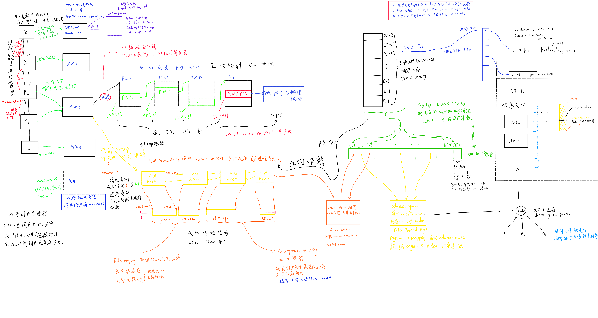

# CSAPP 深入理解计算机系统

## 0x0 无符号整数 二进制补码
<!--没啥好说的-->
int8
0000 0000 0
1000 0000 -128

uint8
0000 0000 0
1000 0000 128
## 0x1 C语言 位操作 树状数组


``` c++
#include <stdlib.h>
#include <stdio.h>

int main() {
  int a = 1<<31;
  printf("%d\n", a+1);
  printf("0x%x\n", a+1);
  return 0;
}

```

``` c++
#include <stdio.h>
#include <stdlib.h>

unsigned LowBit(unsigned x) {
  unsigned a = x & ((~x) + 1);
  return a;
}

#define MAX (1 << 31) - 1

int main() {
  int a = MAX;
  printf("%d\n", a);
  printf("%d\n", (~a));
  printf("%d\n", (~a) + 1);

  int b =0xa;
  printf("0x%x\n", LowBit(b));
  return 0;
}

```

位操作与线段树

``` c++
include <stdio.h>
#include <stdlib.h>

unsigned LowBit(unsigned x) {
  unsigned a = x & ((~x) + 1);
  return a;
}

int main() {
  printf("0x%x\n", LowBit(12)); // 1100

  unsigned n = 7;
  // segment tree
  printf("S[%u] ==", n);
  printf(" T[%u] +", n);
  n = n - LowBit(n);
  printf(" T[%u] +", n);
  n = n - LowBit(n);
  printf(" T[%u] +", n);
  n = n - LowBit(n);
  printf(" T[%u]\n", n);

  return 0;
}

```

位操作计算某个int的16进制表示是否全是字母

``` c++
>
#include <stdlib.h>

unsigned Letter(unsigned x) {
  unsigned x1 = x & 0x22222222;
  unsigned x2 = x & 0x44444444;
  unsigned x3 = x & 0x88888888;
  return (x3 >> 3) & ((x2 >> 2) | (x1 >> 1));
}

int main() {
  printf("0x%x is Letter 0x%x\n", 0xabcdef, Letter(0xabcdef));
  return 0;
}

```

## 0x2 浮点数表示 类型转换

Floating Point

``` c++
>
#include <stdio.h>
#include <stdint.h>

uint32_t uint2float(uint32_t u) {

  if (0x00000000 == u) {
    return  0x00000000;
  }

  int n = 31;
  while (0 <= n && (((u >> n) & 0x1) == 0x0)) {
    n--;
  }

  uint32_t e, f;
  // <= 0000 0000 1.111 1111 1111 1111 1111 1111 小数点后没有超过23 可以表示
  if (u <= 0x00ffffff) {
    uint32_t mask = 0xffffffff >> (32 - n);
    f = (u & mask) << (23 - n);
    e = n + 127;
    return (e << 23) | f;
  } else { // >= 0000 0001. 0000 0000 0000 0000 0000 0000 小数点后超过23 需要近似
    // need rounding
    uint64_t a = 0;
    a += u;

    // compute g, r, s;
    uint32_t g = (a >> (n - 23) & 0x1);
    uint32_t r = (a >> (n - 24) & 0x1);
    uint32_t s = 0x0;
    for (int j = 0;j < n - 24;++j) {
      s = s | ((u >> j) & 0x1);
    }
    // compute carry
    a = a >> (n-23);
    // 0    1    ?    ... ?
    // [24] [23] [22] ... [0]
    if ((r&(g|s)) == 0x1) {
      a = a + 1;
    }

    if ((a >> 23) == 0x1) {
      //  0    1    ?   ...  ?
      // [24] [23] [22] ... [0]
      f = a & 0x007fffff;
      e = n + 127;
      return (e << 23) | f;
    } else if ((a >> 23) == 0x2) { // 最大值
      //  1    0    0   ...  0
      // [24] [23] [22] ... [0]
      e = n + 1 + 127;
      return (e << 23);
    }
  }
  // inf as default error
  return 0x7f800000;
}

// 用一个 uint32 模拟 float32
int main() {
  printf("%x\n", uint2float(0x0000000f));
}

```

## 0x3 cpu 寄存器 汇编 指针

`union` 共用体 共用了低地址
``` c++
#ifndef CPU_H_
#define CPU_H_

#include <stdlib.h>
#include <stdio.h>
#include <stdint.h>

// CPU的状态机
typedef struct CPU_STRUCT {
  union {
    struct{
      uint8_t al;
      uint8_t ah;
    };
    uint16_t ax;
    uint32_t eax;
    uint64_t rax;
  };

  union {
    struct{
      uint8_t bl;
      uint8_t bh;
    };
    uint16_t bx;
    uint32_t ebx;
    uint64_t rbx;
  };

  union {
    struct{
      uint8_t cl;
      uint8_t ch;
    };
    uint16_t cx;
    uint32_t ecx;
    uint64_t rcx;
  };

  union {
    struct{
      uint8_t dl;
      uint8_t dh;
    };
    uint16_t dx;
    uint32_t edx;
    uint64_t rdx;
  };

  union {
    struct{
      uint8_t sil;
      uint8_t sih;
    };
    uint16_t si;
    uint32_t esi;
    uint64_t rsi;
  };

  union {
    struct{
      uint8_t dil;
      uint8_t dih;
    };
    uint16_t di;
    uint32_t edi;
    uint64_t rdi;
  };

  union {
    struct{
      uint8_t bpl;
      uint8_t bph;
    };
    uint16_t bp;
    uint32_t ebp;
    uint64_t rbp;
  };

  union {
    struct{
      uint8_t spl;
      uint8_t sph;
    };
    uint16_t sp;
    uint32_t esp;
    uint64_t rsp;
  };

  union {
    struct{
      uint8_t ipl;
      uint8_t iph;
    };
    uint16_t ip;
    uint32_t eip;
    uint64_t rip;
  };
} cpu_t;

#endif // CPU_H_

```


## 0x4 汇编 译码 虚拟地址

## 0x5 汇编模拟器 基本框架

## 0x6

## 0x7

## 0x8

## 0x9

## 0xA

## 0xB

## 0xC

## 0xD

## 0xE

## 0xF
E(Executable)L(Linkable)F(Format) 可执行可链接的格式

1. 定位目标函数
2. 符号解析
3. 重定位
## 0x10 符号表

``` c++
data1
07 00 00 00              -st_name = "data1"
11                       - st_info
00                       - st_other
02 00                    - st_section = .data
00 00 00 00 00 00 00 00  - st_value
08 00 00 00 00 00 00 00  - st_size

data2
0d 00 00 00              -st_name = "data2"
11                       - st_info
00                       - st_other
02 00                    - st_section = .data
08 00 00 00 00 00 00 00  - st_value
08 00 00 00 00 00 00 00  - st_size

func1
13 00 00 00              -st_name = "func1"
12                       - st_info
00                       - st_other
01 00                    - st_section = .text
00 00 00 00 00 00 00 00  - st_value
07 00 00 00 00 00 00 00  - st_size

func2
19 00 00 00              -st_name = "func2"
12                       - st_info
00                       - st_other
01 00                    - st_section = .text
07 00 00 00 00 00 00 00  - st_value
07 00 00 00 00 00 00 00  - st_size
```

``` c++
Start:
Elf64_Shdr[Elf64_Sym.st_section].sh_offset + Elf64_Sym.st_value

End:
Start + Elf64_Sym.size - 1

ELF[Start, End) - Symbol
```

``` c++
src1.c                 src2.c                 src3.c
  ||                     ||                     ||
  \/    /---Type-----\   \/   /------Type----\  \/
external              external                external ==> linker负责的部分 全局变量 函数
  ||    \---Bind-----/   ||   \-----Bind-----/  ||
  \/                     \/                     \/
internal              internal                internal     局部作用域 分配在stack和heap上 linker不负责这些

```

## 0x11 Bind | Type
`st_info` 是一个`unsigned char(uint8_t)`

``` c++

B i n d  T y p e
_ _ _ _  _ _ _ _
1 2 3 4  5 6 7 8

bind = (st_info >> 4) & 0x0f
type = st_info & 0x0f
st_info = ((bind << 4) & 0xf0) + (type & 0xf)
```

常用的取值

| st_bind | value | st_type | value |
|:-------:|:-----:|:-------:|:-----:|
| LOCAL   | 0000  | NOTYPE  | 0000  |
| GLOBAL  | 0001  | OBJECT  | 0001  |
| WEAK    | 0010  | FUNC    | 0010  |


``` c++

#define STB_LOCAL 0   /* Local symbol */
#define STB_GLOBAL  1   /* Global symbol */
#define STB_WEAK  2   /* Weak symbol */
#define STB_NUM   3   /* Number of defined types.  */
#define STB_LOOS  10    /* Start of OS-specific */
#define STB_GNU_UNIQUE  10    /* Unique symbol.  */
#define STB_HIOS  12    /* End of OS-specific */
#define STB_LOPROC  13    /* Start of processor-specific */
#define STB_HIPROC  15    /* End of processor-specific */

/* Legal values for ST_TYPE subfield of st_info (symbol type).  */

#define STT_NOTYPE  0   /* Symbol type is unspecified */
#define STT_OBJECT  1   /* Symbol is a data object */
#define STT_FUNC  2   /* Symbol is a code object */
#define STT_SECTION 3   /* Symbol associated with a section */
#define STT_FILE  4   /* Symbol's name is file name */
#define STT_COMMON  5   /* Symbol is a common data object */
#define STT_TLS   6   /* Symbol is thread-local data object*/
#define STT_NUM   7   /* Number of defined types.  */
#define STT_LOOS  10    /* Start of OS-specific */
#define STT_GNU_IFUNC 10    /* Symbol is indirect code object */
#define STT_HIOS  12    /* End of OS-specific */
#define STT_LOPROC  13    /* Start of processor-specific */
#define STT_HIPROC  15    /* End of processor-specific */

```


### 有关STB_WEAK
**声明为弱符号，防止我们的程序使用外部函数的时候，未定义，直接崩溃**

``` c++
// src1.c
__attribute__((weak)) int func() {
  return -1;
}

int main() {
  if (func() == -1) {
    printf("func not found!\n");
    exit(1);
  } else if (func() == 2) {
    printf("func found!\n");
  }
}

// src2.c
int func() {
  // do sth.
  return 2;
}
```


**Bind 表明了可见程度**

> COMMOM symbal

``` c++
/* Special section indices.  */

#define SHN_UNDEF 0   /* Undefined section */
#define SHN_LORESERVE 0xff00    /* Start of reserved indices */
#define SHN_LOPROC  0xff00    /* Start of processor-specific */
#define SHN_BEFORE  0xff00    /* Order section before all others
             (Solaris).  */
#define SHN_AFTER 0xff01    /* Order section after all others
             (Solaris).  */
#define SHN_HIPROC  0xff1f    /* End of processor-specific */
#define SHN_LOOS  0xff20    /* Start of OS-specific */
#define SHN_HIOS  0xff3f    /* End of OS-specific */
#define SHN_ABS   0xfff1    /* Associated symbol is absolute */
#define SHN_COMMON  0xfff2    /* Associated symbol is common */
#define SHN_XINDEX  0xffff    /* Index is in extra table.  */
#define SHN_HIRESERVE 0xffff    /* End of reserved indices */

```

### Type
> function

``` c++

// function (bind, type, section index)
extern void f1(); // global, notype, undefined
extern void f2() {} // global, func, .text

void f3(); // global, notype, undefined
void f4() {} // global, func, .text

__attribute__((weak)) extern void f5(); // weak, notype, undefined
__attribute__((weak)) extern void f6() {} // weak, func, .text


__attribute__((weak)) void f7(); // weak, notype, undefined
__attribute__((weak)) void f8() {} // weak, func, .text

static void f9(); // waring: 'f9' used but never define # global, notype, undefined
static void fa() {} // local, func, .text

void g() {
  f1();
  f2();
  f3();
  f4();
  f5();
  f6();
  f7();
  f8();
  f9();
  fa();
}

```

``` c++
gcc -c symbol.c -o symbol.o

readelf -s symbol.o

Symbol table '.symtab' contains 12 entries:
   Num:    Value          Size Type    Bind   Vis      Ndx Name
     0: 0000000000000000     0 NOTYPE  LOCAL  DEFAULT  UND
     1: 0000000000000000     0 FILE    LOCAL  DEFAULT  ABS symbol.c
     2: 0000000000000000     0 SECTION LOCAL  DEFAULT    1 .text
     3: 0000000000000000     7 FUNC    GLOBAL DEFAULT    1 f2
     4: 0000000000000007     7 FUNC    GLOBAL DEFAULT    1 f4
     5: 000000000000000e     7 FUNC    WEAK   DEFAULT    1 f6
     6: 0000000000000015     7 FUNC    WEAK   DEFAULT    1 f8
     7: 000000000000001c    87 FUNC    GLOBAL DEFAULT    1 g
     8: 0000000000000000     0 NOTYPE  GLOBAL DEFAULT  UND f1
     9: 0000000000000000     0 NOTYPE  GLOBAL DEFAULT  UND f3
    10: 0000000000000000     0 NOTYPE  WEAK   DEFAULT  UND f5
    11: 0000000000000000     0 NOTYPE  WEAK   DEFAULT  UND f7
```

> object

``` c++

```// object
extern int d1; // global, notype, undefined
extern int d2 = 0; // 警告：‘d2’已初始化，却又被声明为‘extern’ # global, object, .bss
extern int d3 = 1; // 警告：‘d3’已初始化，却又被声明为‘extern’ # global, object, .data

static int d4; // local, object, .bss
static int d5 = 0; // local, object, .bss
static int d6 = 1; // local, object, .data

int d7; // global, object, COMMON
int d8 = 0; // global, object, .bss
int d9 = 1; // global, object, .data

__attribute__((weak)) int da; // weak, object, .bss
__attribute__((weak)) int db = 0; // weak, object, .bss
__attribute__((weak)) int dc = 1; // weak, object, .data

void object() {
  d1 = 2;
  d2 = 2;
  d3 = 2;
  d4 = 2;
  d5 = 2;
  d6 = 2;
  d7 = 2;
  d8 = 2;
  d9 = 2;
  da = 2;
  db = 2;
  dc = 2;
}


``` c++

readelf -s symbol.o

Symbol table '.symtab' contains 18 entries:
   Num:    Value          Size Type    Bind   Vis      Ndx Name
     0: 0000000000000000     0 NOTYPE  LOCAL  DEFAULT  UND
     1: 0000000000000000     0 FILE    LOCAL  DEFAULT  ABS symbol.c
     2: 0000000000000000     0 SECTION LOCAL  DEFAULT    1 .text
     3: 0000000000000000     0 SECTION LOCAL  DEFAULT    3 .data
     4: 0000000000000000     0 SECTION LOCAL  DEFAULT    4 .bss
     5: 0000000000000014     4 OBJECT  LOCAL  DEFAULT    4 d4
     6: 0000000000000018     4 OBJECT  LOCAL  DEFAULT    4 d5
     7: 0000000000000004     4 OBJECT  LOCAL  DEFAULT    3 d6
     8: 0000000000000000     4 OBJECT  GLOBAL DEFAULT    4 d2
     9: 0000000000000000     4 OBJECT  GLOBAL DEFAULT    3 d3
    10: 0000000000000004     4 OBJECT  GLOBAL DEFAULT    4 d7
    11: 0000000000000008     4 OBJECT  GLOBAL DEFAULT    4 d8
    12: 0000000000000008     4 OBJECT  GLOBAL DEFAULT    3 d9
    13: 000000000000000c     4 OBJECT  WEAK   DEFAULT    4 da
    14: 0000000000000010     4 OBJECT  WEAK   DEFAULT    4 db
    15: 000000000000000c     4 OBJECT  WEAK   DEFAULT    3 dc
    16: 0000000000000000   127 FUNC    GLOBAL DEFAULT    1 object
    17: 0000000000000000     0 NOTYPE  GLOBAL DEFAULT  UND d1
```

## 0x12 ELF文件解析

> linker的结构
1. parse text
2. symbel resolution
3. relocation


> 格式设计

| ELF.o                                                   | text                                      |
|:-------------------------------------------------------:|:-----------------------------------------:|
| header:SHT sht_off+size                                 | [0]line:effective [1] SHT_line            |
| SHT:[0] [1] [2] 每一个都是entry 包含offset到section本身 | [2] <1> <2> <3> 每一行的格式：...,...,... |
| section本体                                             | section本体                               |
  
## 0x13 符号解析

## 0x14 动态链接

GOT Global Offset Table

``` c++
>
#include <string.h>

#define MAX_GOT_SIZE (64)

typedef void(*func_t)();
typedef uint64_t plt_t;

uint64_t got[MAX_GOT_SIZE];

uint64_t dynamic_linker(uint64_t address) {
  // calculate
  return 0xFFFFFFFFFFFFFFFF;
}

void call(uint64_t address) {
  func_t func;;
  *(uint64_t *)&func = address;
  func();
}

void plt_call(uint64_t address) {
  plt_t plt_address = address;

  if (got[plt_address] == 0) {
    // not overwritten
    got[plt_address] = dynamic_linker(address);
  } else {
    // found
    call(got[plt_address]);
  }
}

int main() {
  memset(got, 0, sizeof(uint64_t) * MAX_GOT_SIZE);
}

```

## 0x15 总结

我们所编写的代码文件都是 ASCII的一个文本文件,我们如何将之变为一个进程呢？

1. cpp 预处理 展开宏定义 直接替换
2. as 汇编 交给编译器中的`cc1` 、 `as` 变成.o的目标文件 也就是elf
3. ld 链接 将elf进行符号解析、段合并、重定位为eof

链接器只能看到最外层符号，也就是说只有全局变量、函数(这里不考虑匿名函数)。


## 0x16 虚拟内存

cpu与物理内存之间有bus(数据总线),cpu内部有三级缓存(cache):L1 L2 L3。

而cpu看到的“物理内存”其实是`虚拟内存`,MMU负责将虚拟内存映射到物理内存。对于每一个进程而言，内存都是属于自己的，可以尽情使用，从0x00400000开始一直到0xFFFFFFFFFFFFFFFF,分别有.text .rodata .data heap mmap(动态链接展开处) stack。这些地址通过MMU映射到物理内存的不同区域，而不同的进程之间不共享虚拟内存。

## 0x17 局部性


## 0x18 MESI缓存一致性模型 并行计算性能

> M Exclusive Modified

多个处理器的缓存之间并不共享物理内存，每块缓存都只保存自己的数据，且该部分数据**已被修改**
> E Exclusive Clean

多个处理器的缓存之间并不共享物理内存，每块缓存都只保存自己的数据，且该部分数据**未被修改**
> S Shared Clean

多个处理器的缓存之间共享物理内存，多个缓存块共同保存同一物理地址的数据，且该数据都是未修改的
> I Invalid
没有被缓存的数据

| Ci\Cj | M | E | S | I |
|-------|---|---|---|---|
|   M   | X | X | X | O |
|   E   | X | X | X | O |
|   S   | X | X | O | O |
|   I   | O | O | O | O |

## 0x19 并行计算的性能问题
1. True Sharing
一个全局变量sum,数个线程共享，sum从内存读取后被多个线程读写，由于每一个线程都占据一个cpu,每个cpu都有自己的cache,就会触发MESI导致大量的write back | write allocate | bus broadcast等非常消耗资源的操作。
2. False Sharing
一种直觉上的解决方案是使用数个变量存放sum的分片，之后再reduce。但这样将触发False Sharing。
False Asharing :每个线程拥有自己的sum,但是这些sum是被分配在同一个stack上的，这部分数据很有可能被缓存到/一个cacheline中，导致这一块cacheline更新时继续触发MESI，导致大量的write back | write allocate | bus broadcast等非常消耗资源的操作。

``` c++
SOURCE

#include <pthread.h>
#include <sched.h>
#include <stdint.h>
#include <stdio.h>
#include <stdlib.h>
#include <time.h>

#define PAGE_BYTES (4096)

int64_t result_page0[PAGE_BYTES / sizeof(int64_t)];
int64_t result_page1[PAGE_BYTES / sizeof(int64_t)];
int64_t result_page2[PAGE_BYTES / sizeof(int64_t)];
int64_t result_page3[PAGE_BYTES / sizeof(int64_t)];

typedef struct {
  int64_t *cache_write_ptr;
  int cpu_id;
  int length;
} param_t;

void *work_thread(void *param) {
  param_t *p = (param_t *)param;
  int64_t *ptr = p->cache_write_ptr;
  int cpu_id = p->cpu_id;
  int length = p->length;

  cpu_set_t mask;
  CPU_ZERO(&mask);
  CPU_SET(cpu_id, &mask);
  pthread_setaffinity_np(pthread_self(), sizeof(mask),
                         &mask); // 设置thread的cpu亲和性

  printf("   * thread[%lu] running on cpu[%d] writes to %p\n", pthread_self(),
         sched_getcpu(), ptr);

  for (int i = 0; i < length; ++i) {
    *ptr += 1;
  }
  return NULL;
}

int LENGTH = 50000000;

void true_sharing_run() {
  pthread_t t1, t2;
  param_t p1 = {
      .cache_write_ptr = &result_page0[0], .cpu_id = 0, .length = LENGTH};
  param_t p2 = {
      .cache_write_ptr = &result_page0[0], .cpu_id = 1, .length = LENGTH};

  long t0 = clock();
  pthread_create(&t1, NULL, work_thread, (void *)&p1);
  pthread_create(&t2, NULL, work_thread, (void *)&p2);
  pthread_join(t1, NULL);
  pthread_join(t2, NULL);
  printf("[True Sharing]\n\tresult: %ld; elapsed tick tock: %ld\n",
         result_page0[0], clock() - t0);
}

void false_sharing_run() {
  pthread_t t1, t2;

  param_t p1 = {
      .cache_write_ptr = &result_page1[0], .cpu_id = 0, .length = LENGTH};

  param_t p2 = {
      .cache_write_ptr = &result_page1[1], .cpu_id = 1, .length = LENGTH};

  long t0 = clock();

  pthread_create(&t1, NULL, work_thread, (void *)&p1);
  pthread_create(&t2, NULL, work_thread, (void *)&p2);

  pthread_join(t1, NULL);
  pthread_join(t2, NULL);

  printf("[False Sharing]\n\tresult: %ld; elapsed tick tock: %ld\n",
         result_page1[0] + result_page1[1], clock() - t0);
}

void no_sharing_run() {
  pthread_t t1, t2;

  param_t p1 = {
      .cache_write_ptr = &result_page2[0], .cpu_id = 0, .length = LENGTH};

  param_t p2 = {
      .cache_write_ptr = &result_page3[0], .cpu_id = 1, .length = LENGTH};

  long t0 = clock();

  pthread_create(&t1, NULL, work_thread, (void *)&p1);
  pthread_create(&t2, NULL, work_thread, (void *)&p2);

  pthread_join(t1, NULL);
  pthread_join(t2, NULL);

  printf("[No Sharing]\n\tresult: %ld; elapsed tick tock: %ld\n",
         result_page2[0] + result_page3[0], clock() - t0);
}

int main() {
  true_sharing_run();
  false_sharing_run();
  no_sharing_run();
}

```

## 0x1A 内存 虚拟地址 物理地址
> mod
1. virtual address大小与 physics address 可以匹配
2. 访问冲突

> hashap
1. va 与 pa 可以匹配
2. 访问不冲突
3. 性能太差 破坏了局部性 需要(1+2k)N的空间来存储N的有效数据

> segment
1. va 与 pa可以匹配
2. 访问不冲突
3. 使用**(va0, pa0, D)** 的三元组就可以描述复杂度骤降 3M M为#segment 远远小于N
4. 但也是有问题的，首先是仍然会产生很多碎片，增加计算复杂度
> page
1. va 与 pa可以匹配
2. 访问不冲突
3. 使用定长 (va0, pa0)
4. Table[VPN(virtual page number)] + VPO(virtual page offset) => PA(physics address)
Table[VPN] => PPN(physics page number)
VPN + VPO => VA(virtual address)
5. 仍然会有碎片，但已经是比较好的解决方案了。

## 0x1B 多级页表 

> 多级页表来解决 VPN 范围 2^^36的问题 鉴于其稀疏和局部性的特点

1. PGD page global directory     1/(1<<9)
2. PUD page upper directory      1/(1<<18)
3. PMD page middle directory     1/(1<<27)
4. PT  page table                1/(1<<36)

最终需要分配的页表为 #PGD+#PUD+#PMD+#PT，最坏情况就是一颗完全512叉树

[...|VPN(PGD PUD PMD PT 各9bit 共36bit)|VPO(等同于PPO 12bit)] Virtual Address -> 48bit
  * [ ] 
[...|PPN(40bit)|PPO(等同于VPO 12bit)] Physics Address -> 52bit
_
## 0x1C 虚拟内存系统总览

进程在Linux中其实就是一段活动的内存，用task_struct表示，这个其实就是PCB（Process Control Block）

在task_struct中，关于内存管理的的有两个结构：
1. pgd_t
2. vm_area_struct

> pgd_t 负责地址翻译 也就是MMU

一个Vittual Memory Address 分为 VPN+VPO VPN分为4各部分 PGD PUD PMD PT

使用VPN1从全局PGD中找到PUD，使用VPN2从PUD中定位PMD，使用VPN3从PMD中定位PT，使用VPN4从PT中定位PPN，然后PPN+PPO(VPO)=PAddr

这是从虚拟地址到物理地址的正向映射


> vm_area_struct 用于swap out/in 构建反向映射 然后更新 page table entry(present)



## 0x1D 硬件加速
Translation Lookaside Buffer —— virtual memory to physical memory cache

为 MMU 加速


## 0x1E 垃圾回收
Garbage : 


### Reference Count
- python
### Mark Sweep
- CS:APP
### Mark Compact

### Mark Copy
- SICP Lisp

| parent.PTE(level 4) | parent.VMA | child.PTE(level4 | child.VMA | page desc.count     | 发生的时间            |
|---------------------|------------|------------------|-----------|---------------------|-----------------------|
| va->pa[5] RW        | RW_P       | 没有创建         | 没有创建  | [5]: 1              | before fork           |
| va->pa[5]  RO       | RW_S       | va->pa[5] RO     | RW_S      | [5]: 2              | fork                  |
| va->pa[5] RO        | RW_S       | va->pa[5] RO     | RW_S      | [5]:2               | child call push       |
| va->pa[5] RW        | RW_P       | va->pa[6] RW     | RW_P      | [5]: 2-> 1 [6]:0->1 | after child call push |

当child的一个写操作要修改只读的page时，将发生一个Protection Fault(写保护Fault)

然后trap入Kernel，kernel检查VMA发现是可写的，表示这是一个COW操作，这时会发生一个拷贝

page table entry 也就是 PTE 这是由硬件提供的 它只能提供给我们RO 或者 RW权限的信息

virtual memory area VMA


